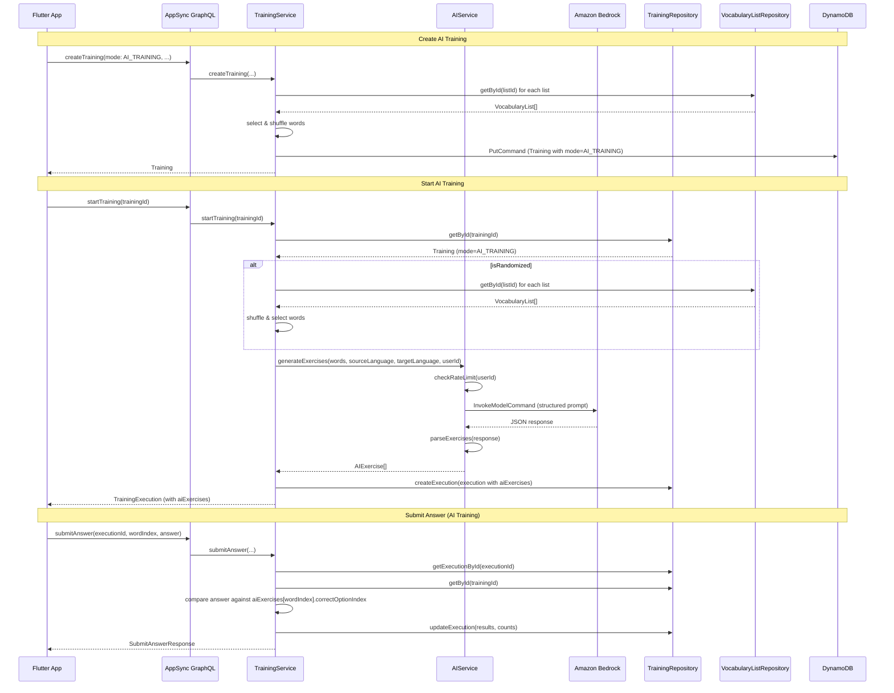

# Design Document: AI Training Mode

## Overview

This feature adds an AI-powered training mode (`AI_TRAINING`) to the existing training system. Unlike `TEXT_INPUT` and `MULTIPLE_CHOICE` modes which test direct word-to-translation recall, AI Training Mode uses Amazon Bedrock to generate contextual language exercises — fill-in-the-blank, verb conjugation, preposition selection, sentence completion — based on selected vocabulary words.

The core flow: when a user starts an AI training, the `TrainingService` selects words (static or randomized), passes them to a new `generateExercises` method on `AIService`, which calls Bedrock with a structured prompt. The response is parsed into `AIExercise` objects, stored on the `TrainingExecution`, and served to the frontend. Answer submission compares the user's selected option index against the `correctOptionIndex` on each exercise.

Key design decisions:
1. **Reuse existing training infrastructure** — AI_TRAINING is a new enum value on `TrainingMode`, not a separate entity. The same `createTraining` / `startTraining` / `submitAnswer` flow applies.
2. **Exercise generation at start time** — Exercises are generated when `startTraining` is called, not at creation time. This keeps training creation fast and allows randomized trainings to get fresh exercises each run.
3. **Single Bedrock call per training start** — All exercises for a training execution are generated in one Bedrock request to minimize latency and rate limit consumption.
4. **Robust parsing with graceful degradation** — Invalid exercises in the Bedrock response are filtered out rather than failing the entire training start.

## Architecture



### Design Decisions

1. **AIExercise stored on TrainingExecution, not Training**: Exercises are generated per-execution (especially important for randomized trainings). Storing them on the execution keeps the Training entity lightweight and allows each run to have different exercises.

2. **Single Bedrock call with batch prompt**: Rather than calling Bedrock once per word, we send all words in a single prompt and ask for a JSON array of exercises. This reduces latency from N API calls to 1 and consumes only 1 rate limit slot.

3. **Answer as option index string**: For AI exercises, the `answer` field in `submitAnswer` contains the stringified option index (e.g., `"2"`). This reuses the existing `SubmitAnswerInput` without schema changes.

4. **Graceful degradation on parse failures**: If some exercises in the Bedrock response are malformed, they're filtered out. The training proceeds with the valid exercises. Only if zero valid exercises remain does the start fail.

5. **Static AI trainings store words at creation**: Like existing modes, static (non-randomized) AI trainings select words at creation time. Randomized AI trainings defer word selection to start time. Both paths call `generateExercises` at start time.

## Components and Interfaces

### Modified Domain Model: Training

```typescript
// backend/src/model/domain/Training.ts — changes
export type TrainingMode = 'TEXT_INPUT' | 'MULTIPLE_CHOICE' | 'AI_TRAINING';

export interface AIExercise {
  prompt: string;           // The exercise sentence with blank/selection point
  options: string[];        // 3-5 answer options
  correctOptionIndex: number; // Index of the correct option in the options array
  exerciseType: string;     // e.g., "verb_conjugation", "preposition", "fill_in_the_blank"
  sourceWord: string;       // The vocabulary word this exercise is based on
}

export interface TrainingExecution {
  // ... existing fields ...
  aiExercises?: AIExercise[];  // Populated for AI_TRAINING executions
}
```

### Modified Service: AIService

New method: `generateExercises`

```typescript
// backend/src/services/ai-service.ts — new method
async generateExercises(
  words: { word: string; translation?: string; definition?: string; partOfSpeech?: string; exampleSentence?: string }[],
  sourceLanguage: string,
  targetLanguage: string,
  userId: string,
): Promise<AIExercise[]>
```

- Checks rate limit (existing `checkRateLimit`)
- Builds a structured prompt including all word fields and both languages
- Calls Bedrock with `InvokeModelCommand`
- Parses response as JSON array
- Validates each exercise (prompt, options length 3-5, correctOptionIndex in range, exerciseType, sourceWord)
- Filters out invalid exercises, logs warnings
- Returns valid `AIExercise[]`
- Throws if zero valid exercises

### Modified Service: TrainingService

**`createTraining`** — accept `AI_TRAINING` as a valid mode. For static AI trainings, word selection works identically to existing modes (fetch from vocab lists, shuffle, slice). For randomized AI trainings, store `words: []` as with existing randomized behavior.

**`startTraining`** — new branch for `AI_TRAINING` mode:
- Select words (from `training.words` for static, dynamically for randomized)
- Fetch vocabulary lists to get full word details (definition, partOfSpeech, exampleSentence) and language info
- Call `AIService.generateExercises(words, sourceLanguage, targetLanguage, userId)`
- Store `aiExercises` on the `TrainingExecution`
- No `multipleChoiceOptions` generated for AI trainings

**`submitAnswer`** — new branch for `AI_TRAINING` mode:
- Look up `execution.aiExercises[wordIndex]`
- Compare `parseInt(answer)` against `exercise.correctOptionIndex`
- Build `TrainingResult` with the prompt as `word`, correct option as `expectedAnswer`
- Completion check: `results.length === aiExercises.length`

### Modified GraphQL Schema

```graphql
# Add to TrainingMode enum
enum TrainingMode @aws_cognito_user_pools {
  TEXT_INPUT
  MULTIPLE_CHOICE
  AI_TRAINING
}

# New type
type AIExercise @aws_cognito_user_pools {
  prompt: String!
  options: [String!]!
  correctOptionIndex: Int!
  exerciseType: String!
  sourceWord: String!
}

# Add to TrainingExecution type
type TrainingExecution @aws_cognito_user_pools {
  # ... existing fields ...
  aiExercises: [AIExercise!]
}
```

### Modified Lambda Resolvers

**`Mutation.createTraining.ts`** — No changes needed; already passes `mode` through to `TrainingService`.

**`Mutation.startTraining.ts`** — No changes needed; calls `service.startTraining()` which handles the AI branch internally.

**`Mutation.submitAnswer.ts`** — No changes needed; calls `service.submitAnswer()` which handles the AI branch internally.

### Frontend Changes

**`training_creation_screen.dart`** — Add `AI_TRAINING` as a third `ChoiceChip` option in the mode selector.

**New widget: `ai_exercise_widget.dart`** — Displays an AI exercise during training:
- Shows exercise type label (e.g., "Verb Conjugation")
- Shows prompt sentence
- Shows answer options as tappable buttons
- On selection, submits the option index as the answer
- Shows correct/incorrect feedback with the correct answer highlighted

**`training_provider.dart`** — Update `startTraining` GraphQL query to fetch `aiExercises { prompt options correctOptionIndex exerciseType sourceWord }` on the execution.

## Data Models

### Training Entity (DynamoDB)

No new fields on Training. The existing `mode` field now accepts `'AI_TRAINING'` in addition to `'TEXT_INPUT'` and `'MULTIPLE_CHOICE'`.

| Field | Type | Notes |
|---|---|---|
| id | string | Partition key |
| userId | string | GSI: userId-index |
| name | string | |
| mode | 'TEXT_INPUT' \| 'MULTIPLE_CHOICE' \| 'AI_TRAINING' | Extended with new value |
| direction | 'WORD_TO_TRANSLATION' \| 'TRANSLATION_TO_WORD' | |
| vocabularyListIds | string[] | |
| words | TrainingWord[] | Empty for randomized trainings |
| isRandomized | boolean? | |
| randomizedWordCount | number? | |
| units | string[]? | |
| createdAt | string | ISO 8601 |
| updatedAt | string | ISO 8601 |

### TrainingExecution Entity (DynamoDB)

| Field | Type | Notes |
|---|---|---|
| id | string | Partition key |
| trainingId | string | GSI: trainingId-index |
| userId | string | |
| startedAt | string | ISO 8601 |
| completedAt | string? | |
| abortedAt | string? | |
| results | TrainingResult[] | |
| multipleChoiceOptions | MultipleChoiceOption[]? | Not used for AI_TRAINING |
| words | TrainingWord[]? | For randomized executions |
| aiExercises | AIExercise[]? | New field. Populated for AI_TRAINING executions |
| correctCount | number | |
| incorrectCount | number | |

### AIExercise Structure

| Field | Type | Notes |
|---|---|---|
| prompt | string | Exercise sentence with blank (e.g., "She ___ to the store yesterday") |
| options | string[] | 3-5 answer options |
| correctOptionIndex | number | Index into options array (0-based) |
| exerciseType | string | e.g., "verb_conjugation", "preposition", "fill_in_the_blank", "sentence_completion" |
| sourceWord | string | The vocabulary word this exercise targets |

No new DynamoDB tables or GSIs are needed.


## Correctness Properties

*A property is a characteristic or behavior that should hold true across all valid executions of a system — essentially, a formal statement about what the system should do. Properties serve as the bridge between human-readable specifications and machine-verifiable correctness guarantees.*

### Property 1: AI training creation stores mode correctly

*For any* valid user ID, vocabulary list IDs, and training parameters with mode set to `AI_TRAINING`, creating a training SHALL produce a Training entity with `mode === 'AI_TRAINING'`, the correct `userId`, and `vocabularyListIds` matching the input.

**Validates: Requirements 1.3**

### Property 2: AI exercise prompt construction includes all context

*For any* set of vocabulary words (each with word, translation, definition, partOfSpeech, exampleSentence) and any source/target language pair, the prompt sent to Bedrock SHALL contain every word's fields and both language names.

**Validates: Requirements 2.2, 2.5**

### Property 3: AI exercise parsing and validation

*For any* JSON array containing a mix of valid and invalid AI exercise objects, parsing SHALL return only exercises that have a non-empty `prompt`, an `options` array of length 3–5, a `correctOptionIndex` within the options range, a non-empty `exerciseType`, and a non-empty `sourceWord`. Invalid entries SHALL be excluded.

**Validates: Requirements 2.3, 2.6, 7.1, 7.3**

### Property 4: AI exercise round-trip serialization

*For any* valid `AIExercise` object, serializing it to JSON and parsing it back SHALL produce an equivalent `AIExercise` object with identical field values.

**Validates: Requirements 7.5**

### Property 5: AI training start produces one exercise per selected word

*For any* AI training with N selected vocabulary words (where N ≥ 1), starting the training SHALL produce a `TrainingExecution` whose `aiExercises` array has length equal to the number of valid exercises returned by the AI service (≤ N), and each exercise's `sourceWord` SHALL correspond to one of the selected vocabulary words.

**Validates: Requirements 2.1, 4.1, 4.3**

### Property 6: AI answer submission and completion

*For any* AI training execution with K exercises, submitting the `correctOptionIndex` as the answer for exercise at index I SHALL yield `correct === true`, and submitting any other valid index SHALL yield `correct === false`. After submitting answers for all K exercises, the execution SHALL be marked as completed with `correctCount + incorrectCount === K`.

**Validates: Requirements 4.4, 4.5**

### Property 7: Randomized AI training dynamic selection and generation

*For any* randomized training with mode `AI_TRAINING` and attached vocabulary lists, starting the training SHALL dynamically select words (subset of available words, respecting `randomizedWordCount`), generate AI exercises for those words, and store both `words` and `aiExercises` on the `TrainingExecution`.

**Validates: Requirements 5.1, 5.2**

### Property 8: Non-AI trainings backward compatibility

*For any* training with mode `TEXT_INPUT` or `MULTIPLE_CHOICE`, starting the training SHALL NOT invoke the AI service and SHALL follow the existing execution flow (producing `multipleChoiceOptions` for MC mode, no `aiExercises` field).

**Validates: Requirements 10.1**

## Error Handling

| Scenario | Behavior | Error Message |
|---|---|---|
| AI exercise generation fails (Bedrock error) | Reject start, no execution created | "Failed to generate AI exercises: {error}" |
| Bedrock response is invalid JSON | Reject start, no execution created | "Failed to parse AI exercise response" |
| All parsed exercises are invalid | Reject start, no execution created | "No valid exercises could be generated" |
| Rate limit exceeded during exercise generation | Reject start, no execution created | "Rate limit exceeded. Please wait before making more AI requests." |
| No words available for AI training | Reject start, no execution created | "No words available from the selected vocabulary lists" |
| Invalid word index on AI answer submission | Reject answer | "Invalid word index" |
| Answer submitted for already-answered exercise | Reject answer | "Answer already submitted for this word" |
| Training not found | Reject with error | "Training not found" |
| User not authorized | Reject with auth error | "Not authorized" |

Error responses follow the existing `{ success: false, error: string }` pattern.

## Testing Strategy

### Unit Tests (Example-Based)

- AI service `generateExercises` returns error when Bedrock fails (Req 2.7)
- AI service `generateExercises` returns rate limit error when limit exceeded (Req 6.1, 6.2)
- AI service logs usage with userId, operation, tokenCount (Req 6.3)
- Bedrock response with invalid JSON returns parsing error (Req 7.2)
- All exercises invalid returns error (Req 7.4)
- Start AI training with 0 available words returns error (Req 4.6)
- GraphQL schema contains `AI_TRAINING` enum value, `AIExercise` type, and `aiExercises` field (Req 1.1, 3.1, 3.2)
- Existing TEXT_INPUT/MULTIPLE_CHOICE trainings unaffected (Req 10.2, 10.3)
- Frontend displays AI Training Mode option (Req 8.1, 8.2, 8.3)
- Frontend displays exercise with type label, prompt, options (Req 9.1, 9.2, 9.3, 9.4)

### Property-Based Tests

Property-based tests use `fast-check` (already in the project) with `aws-sdk-client-mock` for DynamoDB mocking, consistent with `backend/test/training-service.property.test.ts`.

- Minimum 100 iterations per property test
- Each test tagged with: **Feature: ai-training-mode, Property {number}: {title}**
- Tests target `TrainingService` and `AIService` methods with mocked dependencies

| Property | Test Description | Key Arbitraries |
|---|---|---|
| Property 1 | Create AI training, verify mode and fields stored | `fc.uuid()`, `fc.array(fc.uuid())`, mode=`AI_TRAINING` |
| Property 2 | Build exercise prompt, verify all word fields and languages present | `fc.record({ word, translation, definition, partOfSpeech, exampleSentence })`, `fc.string()` for languages |
| Property 3 | Parse mixed valid/invalid exercise arrays, verify only valid returned | `fc.array()` of valid and invalid exercise records |
| Property 4 | Serialize then parse AIExercise, verify equivalence | `fc.record({ prompt, options, correctOptionIndex, exerciseType, sourceWord })` |
| Property 5 | Start AI training, verify exercise count and sourceWord mapping | Vocab lists with random words, mocked AI service |
| Property 6 | Submit correct/incorrect answers, verify correctness and completion | Random AI exercises with known correct indices |
| Property 7 | Start randomized AI training, verify dynamic selection + generation | Random vocab lists, randomizedWordCount |
| Property 8 | Start TEXT_INPUT/MC training, verify no AI service invocation | Random trainings with non-AI modes, spy on AI service |

### Frontend Tests

- Widget tests for AI Training Mode chip in creation screen
- Widget tests for AI exercise display widget (type label, prompt, option buttons)
- Widget tests for answer feedback (correct/incorrect display)
- Widget tests for results summary after completion
- Integration tests verifying GraphQL mutation/query payloads include `aiExercises` fields
