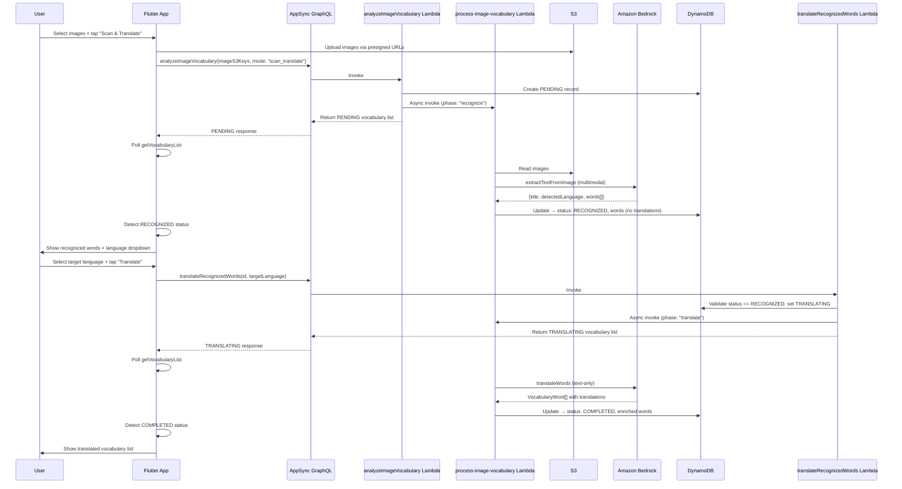

# Design Document: Image Scan & Translate

## Overview

This design extends the existing image vocabulary scan pipeline with a two-phase "Scan & Translate" mode. The current flow (`analyzeImageVocabulary` → `process-image-vocabulary`) assumes images already contain vocabulary lists with translations (e.g., textbook pages) and performs extraction + translation in a single Bedrock call. The new mode splits this into two distinct phases:

1. **Phase 1 — Recognition**: OCR-style text extraction from arbitrary images (signs, menus, labels, handwritten notes) with automatic source language detection. The vocabulary list transitions to a new `RECOGNIZED` status.
2. **Phase 2 — Translation**: User selects a target language, then a second mutation triggers translation and enrichment of the recognized words. The list transitions through `TRANSLATING` to `COMPLETED`.

This two-phase approach lets users review recognized words and choose a target language before translation, while keeping each phase within Lambda timeout limits.

### Key Design Decisions

- **Reuse existing async pattern**: Both phases use the same fire-and-forget Lambda invocation pattern (`InvocationType: 'Event'`) already proven in the current image scan flow.
- **Single Processing Lambda with phase parameter**: Rather than creating a separate Lambda for Phase 2, the existing `process-image-vocabulary` Lambda is extended with a `phase` parameter (`recognize` | `translate`). This reduces infrastructure duplication and keeps deployment simple.
- **New AI service methods**: Two new methods on `AIService` — `extractTextFromImage()` (multimodal, image → words + language) and `translateWords()` (text-only, words → enriched vocabulary). This cleanly separates concerns from the existing `analyzeImageForVocabulary()` which remains unchanged.
- **New GraphQL mutation**: `translateRecognizedWords` accepts a vocabulary list ID and target language, validates the list is in `RECOGNIZED` status, and triggers Phase 2.
- **Frontend polling reuse**: The existing `_pollForCompletion` pattern in `VocabularyProvider` is extended to handle the new intermediate statuses (`RECOGNIZED`, `TRANSLATING`).

## Architecture



## Components and Interfaces

### Backend Components

#### 1. AIService — New Methods

```typescript
// New method: OCR extraction only (multimodal)
async extractTextFromImage(
  imageBase64: string,
  userId: string,
  options?: { skipRateLimit?: boolean }
): Promise<{
  title: string;
  detectedLanguage: string;
  words: string[];
}>

// New method: Translation only (text-based, no image)
async translateWords(
  words: string[],
  sourceLanguage: string,
  targetLanguage: string,
  userId: string,
  options?: { skipRateLimit?: boolean }
): Promise<VocabularyWord[]>
```

`extractTextFromImage` uses `buildMultimodalRequestBody` with a focused OCR prompt. `translateWords` uses `buildRequestBody` (text-only) with a translation prompt. Both follow existing error handling and JSON repair patterns.

#### 2. process-image-vocabulary Lambda — Extended

The handler gains a `phase` field in its event:

```typescript
interface ProcessEvent {
  vocabularyListId: string;
  userId: string;
  imageS3Keys: string[];
  sourceLanguage?: string;
  targetLanguage?: string;
  phase?: 'recognize' | 'translate'; // NEW — undefined = legacy behavior
}
```

- `phase: 'recognize'` → calls `extractTextFromImage` for each image, merges + deduplicates words, updates record to `RECOGNIZED`.
- `phase: 'translate'` → reads existing words from DynamoDB, calls `translateWords`, updates record to `COMPLETED`.
- `phase: undefined` → existing behavior (backward compatible).

#### 3. New Lambda: Mutation.translateRecognizedWords

```typescript
interface TranslateRecognizedWordsInput {
  vocabularyListId: string;
  targetLanguage: string;
}
```

Validates:
- Vocabulary list exists and belongs to the authenticated user
- Status is `RECOGNIZED`

Then sets status to `TRANSLATING` and async-invokes `process-image-vocabulary` with `phase: 'translate'`.

#### 4. GraphQL Schema Changes

```graphql
# New enum values
enum VocabularyListStatus {
  PENDING
  RECOGNIZED        # NEW
  TRANSLATING       # NEW
  COMPLETED
  PARTIALLY_COMPLETED
  FAILED
}

# New input type
input TranslateRecognizedWordsInput {
  vocabularyListId: ID!
  targetLanguage: String!
}

# New mutation input for scan mode
input AnalyzeImageVocabularyInput {
  imageS3Keys: [String!]!
  sourceLanguage: String
  targetLanguage: String
  mode: String          # NEW — "scan_translate" or omitted for legacy
}

# New mutation
type Mutation {
  translateRecognizedWords(input: TranslateRecognizedWordsInput!): VocabularyListResponse
}
```

### Frontend Components

#### 5. New Screen: ScanTranslateScreen

A new Flutter screen (`scan_translate_screen.dart`) accessible from the existing image vocabulary flow. It manages the full two-phase lifecycle:

- **Image selection**: Reuses `ImagePicker` pattern from `ImageVocabularyScreen`
- **Phase 1 polling**: Shows "Recognizing words..." while polling for `RECOGNIZED` status
- **Word review + language selection**: Displays recognized words, detected source language, and a target language dropdown
- **Phase 2 trigger**: Calls `translateRecognizedWords` mutation, shows "Translating words..." while polling for `COMPLETED`
- **Result display**: Shows the full enriched vocabulary list

#### 6. VocabularyProvider Extensions

```dart
// New method for Phase 2
Future<Map<String, dynamic>?> translateRecognizedWords(
  String vocabularyListId,
  String targetLanguage,
)

// Extended polling to handle RECOGNIZED and TRANSLATING statuses
Future<Map<String, dynamic>?> _pollForCompletion(String id, {String? targetStatus})
```

The existing `_pollForCompletion` is updated to accept an optional `targetStatus` parameter. When polling for Phase 1, it stops at `RECOGNIZED`. When polling for Phase 2, it stops at `COMPLETED`/`PARTIALLY_COMPLETED`.

## Data Models

### VocabularyListStatus (Extended)

```typescript
export type VocabularyListStatus =
  | 'PENDING'
  | 'RECOGNIZED'      // NEW — Phase 1 complete, words extracted, awaiting translation
  | 'TRANSLATING'     // NEW — Phase 2 in progress
  | 'COMPLETED'
  | 'PARTIALLY_COMPLETED'
  | 'FAILED';
```

### VocabularyList (Extended)

The existing `VocabularyList` interface gains a `mode` field:

```typescript
export interface VocabularyList {
  // ... existing fields ...
  mode?: 'standard' | 'scan_translate'; // NEW — distinguishes legacy vs new flow
}
```

When `mode === 'scan_translate'` and `status === 'RECOGNIZED'`, the `words` array contains objects with `word` populated but `translation`, `definition`, `exampleSentence`, etc. empty/undefined. After Phase 2 completes, these fields are populated.

### Recognition Result (Intermediate — not persisted separately)

```typescript
interface RecognitionResult {
  title: string;
  detectedLanguage: string;
  words: string[]; // deduplicated list of recognized words
}
```

This is the return type of `extractTextFromImage`. It is mapped into `VocabularyWord[]` (with only `word` and `definition` set to placeholder) before persisting to DynamoDB.

### AI Prompt Response Schemas

**OCR Extraction Response:**
```json
{
  "title": "Menu at Café de Flore",
  "detectedLanguage": "French",
  "words": ["croissant", "café", "baguette", "fromage"]
}
```

**Translation Response:**
```json
[
  {
    "word": "croissant",
    "translation": "croissant",
    "definition": "A flaky, buttery pastry",
    "partOfSpeech": "noun",
    "exampleSentence": "I had a croissant for breakfast.",
    "difficulty": "easy"
  }
]
```


## Correctness Properties

*A property is a characteristic or behavior that should hold true across all valid executions of a system — essentially, a formal statement about what the system should do. Properties serve as the bridge between human-readable specifications and machine-verifiable correctness guarantees.*

### Property 1: Word deduplication preserves unique entries

*For any* list of extracted words (including duplicates), after deduplication, the result should contain exactly the set of unique words from the input — no duplicates remain, and no unique word is lost.

**Validates: Requirements 1.5**

### Property 2: Batch processing resilience

*For any* batch of images where each image independently succeeds or fails, the processing Lambda should: include words from all successful images in the result, record the count of failed images, and set the final status to FAILED (if all fail), PARTIALLY_COMPLETED (if some fail), or RECOGNIZED/COMPLETED (if none fail).

**Validates: Requirements 1.6, 5.7, 5.8**

### Property 3: Phase 1 recognition produces untranslated word list

*For any* set of successfully extracted words and a detected source language, after Phase 1 completes, the vocabulary list record should have status `RECOGNIZED`, the `sourceLanguage` field set to the detected language, and every word entry should have the `word` field populated but `translation` empty or undefined.

**Validates: Requirements 5.3**

### Property 4: Phase 2 translation produces enriched vocabulary

*For any* vocabulary list in `RECOGNIZED` status with extracted words and a valid target language, after Phase 2 completes, the vocabulary list record should have status `COMPLETED`, the `targetLanguage` field set, and every word entry should have `word`, `translation`, `definition`, `partOfSpeech`, `exampleSentence`, and `difficulty` populated.

**Validates: Requirements 5.6**

### Property 5: VocabularyWord field constraints

*For any* VocabularyWord produced by the translation engine, the `definition` field should contain at most 20 words, the `exampleSentence` field should contain at most 15 words, the `partOfSpeech` should be one of (noun, verb, adjective, adverb, other), and the `difficulty` should be one of (easy, medium, hard).

**Validates: Requirements 4.2**

### Property 6: translateRecognizedWords validation

*For any* combination of vocabulary list ID, authenticated user ID, and vocabulary list status, the `translateRecognizedWords` mutation should accept the request only when the list exists, belongs to the authenticated user, and has status `RECOGNIZED`. All other combinations should return an appropriate error message.

**Validates: Requirements 6.2, 6.3, 6.4, 7.3**

### Property 7: JSON repair recovers valid subsets from truncated output

*For any* valid JSON object matching the OCR extraction or translation response schema, if the JSON string is truncated at an arbitrary position after at least one complete word entry, the `repairTruncatedJson` method should either produce a valid JSON object containing a subset of the original words, or throw an error — it should never produce invalid JSON.

**Validates: Requirements 10.5**

## Error Handling

### Phase 1 (Recognition) Errors

| Error Condition | Handling | Status |
|---|---|---|
| All images fail Bedrock processing | Set status to `FAILED` with first error message | `FAILED` |
| Some images fail | Process successful images, set `PARTIALLY_COMPLETED` with failure count | `PARTIALLY_COMPLETED` |
| S3 image read failure | Treat as image failure, continue with remaining | Per-image failure |
| Bedrock throttling | Retry with exponential backoff (existing pattern) | Retry |
| Bedrock model unavailable | Fail with descriptive error | `FAILED` |
| Empty words extracted (no text in image) | Include image as success with 0 words | Continue |
| Malformed JSON from Bedrock | Attempt `repairTruncatedJson`, fail if unrecoverable | Per-image failure |
| Rate limit exceeded | Return error immediately (existing pattern) | No record created |

### Phase 2 (Translation) Errors

| Error Condition | Handling | Status |
|---|---|---|
| Vocabulary list not found | Return error: "Vocabulary list not found" | No change |
| List not owned by user | Return error: "Vocabulary list not found" | No change |
| Status not RECOGNIZED | Return error: "Vocabulary list is not ready for translation" | No change |
| Bedrock translation failure | Set status to `FAILED` with error message | `FAILED` |
| Partial translation (some words fail) | Include untranslatable words with empty translation | `COMPLETED` |
| Malformed JSON from Bedrock | Attempt `repairTruncatedJson`, fail if unrecoverable | `FAILED` |

### Usage Limit Errors

| Error Condition | Handling |
|---|---|
| Image scan limit exceeded | Return `UPGRADE_REQUIRED` error before creating record |
| Vocabulary list limit exceeded | Return `UPGRADE_REQUIRED` error before creating record |

### Frontend Error Handling

- Polling timeout (3 minutes): Show message "Processing is running in the background" with link to vocabulary lists
- Network errors during polling: Retry silently, don't break polling loop
- GraphQL errors: Display error message with retry option
- Source language == target language: Show warning dialog, allow user to proceed or change selection

## Testing Strategy

### Unit Tests

- **Mutation.analyzeImageVocabulary**: Verify PENDING record creation, async Lambda invocation with `phase: 'recognize'`, usage limit checks, input validation (S3 key format), error responses for exceeded limits
- **Mutation.translateRecognizedWords**: Verify validation logic (ownership, status checks), status update to TRANSLATING, async Lambda invocation with `phase: 'translate'`, error responses for invalid states
- **process-image-vocabulary (Phase 1)**: Verify word extraction from mocked AI responses, deduplication logic, status update to RECOGNIZED, error handling for failed images
- **process-image-vocabulary (Phase 2)**: Verify translation from mocked AI responses, status update to COMPLETED, enriched word structure
- **AIService.extractTextFromImage**: Verify prompt construction, multimodal request body format, response parsing, JSON repair fallback
- **AIService.translateWords**: Verify prompt construction, text request body format, response parsing, VocabularyWord validation
- **Frontend widget tests**: ScanTranslateScreen states (image selection, recognizing, recognized, translating, completed, error), language dropdown behavior, source==target warning

### Property-Based Tests

Property-based tests use `fast-check` (already available in the project) with minimum 100 iterations per property. Each test is tagged with its design property reference.

- **Property 1**: Generate random string arrays with duplicates → verify deduplication output
  - Tag: `Feature: image-scan-translation, Property 1: Word deduplication preserves unique entries`
- **Property 2**: Generate random image batch results (success/failure patterns) → verify status and word aggregation
  - Tag: `Feature: image-scan-translation, Property 2: Batch processing resilience`
- **Property 3**: Generate random extraction results → verify RECOGNIZED state invariants
  - Tag: `Feature: image-scan-translation, Property 3: Phase 1 recognition produces untranslated word list`
- **Property 4**: Generate random word lists + target languages → verify COMPLETED state invariants
  - Tag: `Feature: image-scan-translation, Property 4: Phase 2 translation produces enriched vocabulary`
- **Property 5**: Generate random VocabularyWord objects → verify field constraints
  - Tag: `Feature: image-scan-translation, Property 5: VocabularyWord field constraints`
- **Property 6**: Generate random (listId, userId, status) combinations → verify validation accepts/rejects correctly
  - Tag: `Feature: image-scan-translation, Property 6: translateRecognizedWords validation`
- **Property 7**: Generate valid JSON, truncate at random positions → verify repair produces valid JSON or throws
  - Tag: `Feature: image-scan-translation, Property 7: JSON repair recovers valid subsets from truncated output`

### Integration Tests

- End-to-end Phase 1 with sample images against Bedrock (1-2 tests)
- End-to-end Phase 2 with sample word lists against Bedrock (1-2 tests)
- Full two-phase flow: image upload → recognition → translation → completed vocabulary list
- CDK stack deployment verification: new Lambda, GraphQL schema changes, IAM permissions
