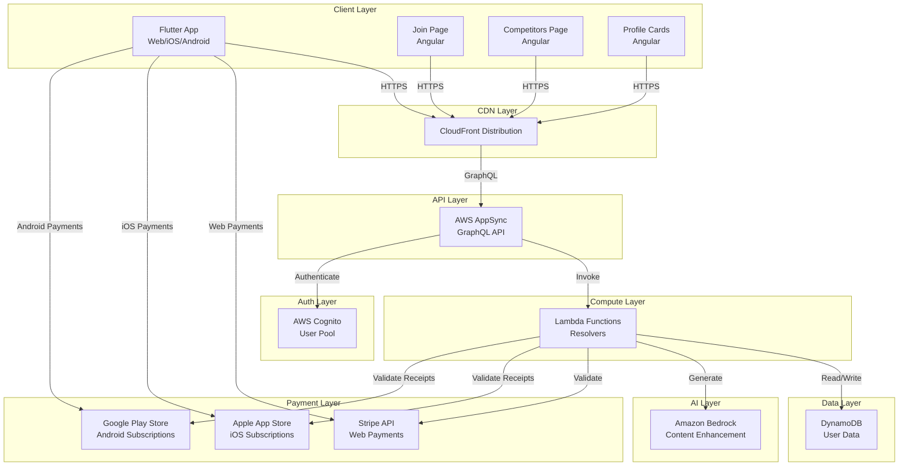
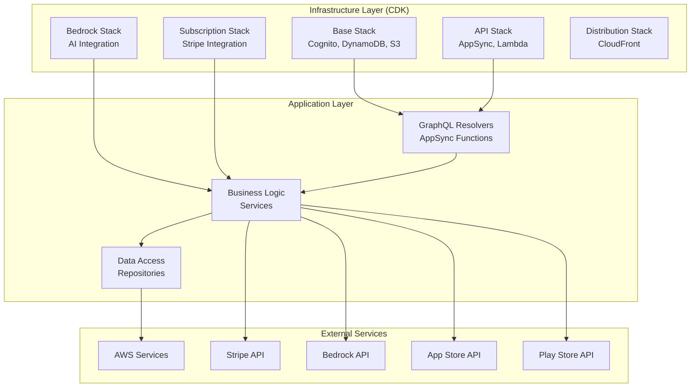
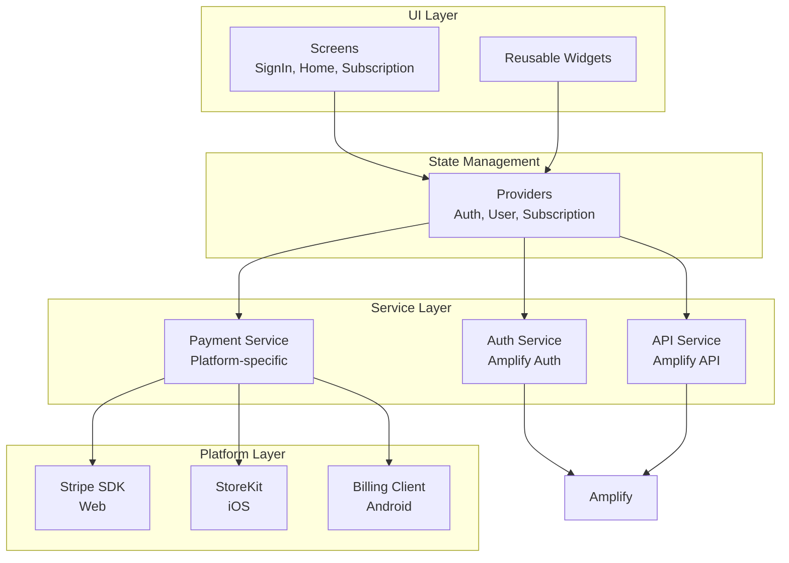

# Design Document: Minimal SaaS Template

## Overview

The minimal SaaS template provides a production-ready foundation for building Flutter-based SaaS applications with AWS backend infrastructure. The design is based on the proven nexus-share architecture but stripped down to essential components only.

### System Architecture

The template consists of three main components:

1. **Backend Infrastructure**: AWS CDK-based infrastructure providing authentication (Cognito), data storage (DynamoDB), GraphQL API (AppSync), serverless compute (Lambda), AI capabilities (Bedrock), and content delivery (CloudFront)

2. **Flutter Frontend**: Cross-platform application supporting web (primary), iOS, and Android with Amplify integration for AWS services

3. **Angular Landing Pages**: Three standalone pages for marketing (join page), competitive analysis (competitors page), and public profiles (profile cards)

### Design Principles

- **Minimalism**: Include only essential features needed for a working SaaS application
- **Extensibility**: Provide clear extension points for adding features
- **Multi-platform**: Support web, iOS, and Android from a single Flutter codebase
- **Infrastructure as Code**: All AWS resources defined in CDK for reproducibility
- **Type Safety**: TypeScript backend and strongly-typed GraphQL schema
- **Testing**: Comprehensive test infrastructure for backend and frontend

## Architecture

### High-Level Architecture



### Backend Architecture

The backend follows a layered architecture:



### Frontend Architecture

The Flutter frontend uses a provider-based state management pattern:



## Components and Interfaces

### Backend Components

#### 1. CDK Stacks

**BaseStack**
- Purpose: Core infrastructure including Cognito, DynamoDB, and S3
- Exports: User pool ID, user pool client ID, DynamoDB table name
- Dependencies: None

**APIStack**
- Purpose: AppSync GraphQL API and Lambda resolvers
- Exports: API endpoint URL, API ID
- Dependencies: BaseStack (user pool, DynamoDB table)

**BedrockStack**
- Purpose: Amazon Bedrock integration for AI content enhancement
- Exports: Bedrock model ARN, IAM role ARN
- Dependencies: None

**SubscriptionStack**
- Purpose: Stripe integration and subscription management
- Exports: Stripe webhook endpoint URL
- Dependencies: BaseStack (DynamoDB table)

**DistributionStack**
- Purpose: CloudFront distribution for frontend hosting
- Exports: Distribution domain name, distribution ID
- Dependencies: APIStack (API endpoint)

#### 2. GraphQL Schema

```graphql
type User {
  id: ID!
  email: String!
  name: String
  subscriptionStatus: SubscriptionStatus
  subscriptionProvider: PaymentProvider
  createdAt: AWSDateTime!
  updatedAt: AWSDateTime!
}

type Subscription {
  id: ID!
  userId: ID!
  provider: PaymentProvider!
  status: SubscriptionStatus!
  planId: String
  currentPeriodEnd: AWSDateTime
  createdAt: AWSDateTime!
  updatedAt: AWSDateTime!
}

enum SubscriptionStatus {
  ACTIVE
  INACTIVE
  CANCELLED
  PAST_DUE
}

enum PaymentProvider {
  STRIPE
  APPLE_APP_STORE
  GOOGLE_PLAY_STORE
}

type Query {
  getUser(id: ID!): User
  getSubscriptionStatus: Subscription
}

type Mutation {
  createUser(email: String!, name: String): User
  updateUser(id: ID!, name: String): User
  
  # Payment operations
  createSubscription(provider: PaymentProvider!, planId: String): Subscription
  cancelSubscription: Subscription
  validateAppStoreReceipt(receiptData: String!): Subscription
  validatePlayStoreReceipt(purchaseToken: String!, productId: String!): Subscription
  
  # AI operations
  enhanceContent(content: String!): String
  generateContent(prompt: String!): String
}
```

#### 3. Repository Layer

**UserRepository**
- Methods:
  - `create(user: User): Promise<User>`
  - `getById(id: string): Promise<User | null>`
  - `update(id: string, updates: Partial<User>): Promise<User>`
  - `delete(id: string): Promise<void>`
- DynamoDB Operations: PutItem, GetItem, UpdateItem, DeleteItem
- Key Schema: Partition key = `id` (string)

**SubscriptionRepository**
- Methods:
  - `create(subscription: Subscription): Promise<Subscription>`
  - `getByUserId(userId: string): Promise<Subscription | null>`
  - `update(id: string, updates: Partial<Subscription>): Promise<Subscription>`
  - `delete(id: string): Promise<void>`
- DynamoDB Operations: PutItem, GetItem, UpdateItem, DeleteItem, Query
- Key Schema: Partition key = `id` (string), GSI on `userId`

#### 4. Service Layer

**AuthService**
- Methods:
  - `register(email: string, password: string): Promise<void>`
  - `signIn(email: string, password: string): Promise<AuthTokens>`
  - `signOut(): Promise<void>`
  - `refreshTokens(refreshToken: string): Promise<AuthTokens>`
- Dependencies: AWS Cognito SDK

**PaymentService**
- Methods:
  - `createStripeSubscription(userId: string, planId: string): Promise<Subscription>`
  - `cancelStripeSubscription(subscriptionId: string): Promise<void>`
  - `validateAppStoreReceipt(receiptData: string): Promise<ReceiptValidation>`
  - `validatePlayStoreReceipt(purchaseToken: string, productId: string): Promise<ReceiptValidation>`
  - `handleStripeWebhook(event: StripeEvent): Promise<void>`
- Dependencies: Stripe SDK, Apple App Store API, Google Play Store API, SubscriptionRepository

**AIService**
- Methods:
  - `enhanceContent(content: string): Promise<string>`
  - `generateContent(prompt: string): Promise<string>`
- Dependencies: Amazon Bedrock SDK
- Rate Limiting: 10 requests per minute per user

### Frontend Components

#### 1. Screens

**SignInScreen**
- Purpose: User authentication
- State: email, password, loading, error
- Actions: signIn(), navigateToRegister()
- Navigation: On success → HomeScreen

**RegisterScreen**
- Purpose: New user registration
- State: email, password, name, loading, error
- Actions: register(), navigateToSignIn()
- Navigation: On success → HomeScreen

**HomeScreen**
- Purpose: Main authenticated user interface
- State: user, loading
- Actions: signOut(), navigateToSubscription()
- Navigation: On signOut → SignInScreen

**SubscriptionScreen**
- Purpose: Subscription management
- State: subscription, loading, error, platform
- Actions: subscribe(), cancel(), openStripeCheckout(), openAppStorePurchase(), openPlayStorePurchase()
- Platform Detection: Uses Platform.isIOS, Platform.isAndroid, kIsWeb

#### 2. Providers

**AuthProvider**
- State: currentUser, isAuthenticated, isLoading
- Methods: signIn(), signOut(), register(), refreshSession()
- Notifies: Listeners on auth state changes

**UserProvider**
- State: user, isLoading
- Methods: loadUser(), updateUser()
- Dependencies: AuthProvider, APIService

**SubscriptionProvider**
- State: subscription, isLoading
- Methods: loadSubscription(), createSubscription(), cancelSubscription()
- Dependencies: AuthProvider, APIService, PaymentService

#### 3. Services

**AmplifyAuthService**
- Methods: signIn(), signOut(), register(), getCurrentUser()
- Configuration: Cognito user pool ID, client ID

**AmplifyAPIService**
- Methods: query(), mutate()
- Configuration: AppSync endpoint, API key/auth mode

**PlatformPaymentService**
- Methods: initializePayment(), processPayment(), validateReceipt()
- Platform-specific implementations:
  - Web: Stripe Checkout
  - iOS: StoreKit
  - Android: Google Play Billing

### Angular Landing Pages

#### 1. Join Page

**Components**:
- HeroComponent: Value proposition and CTA
- FeaturesComponent: Key feature highlights
- CTAComponent: Registration call-to-action

**Routing**: Standalone application, no routing needed

**API Integration**: Links to Flutter app registration URL

#### 2. Competitors Page

**Components**:
- ComparisonTableComponent: Feature comparison matrix
- HeaderComponent: Page title and description

**Routing**: Standalone application

**Data**: Static comparison data (no API calls)

#### 3. Profile Cards Page

**Components**:
- ProfileCardComponent: User profile display
- LoadingComponent: Loading state

**Routing**: URL parameter for user ID (`/profile/:userId`)

**API Integration**: GraphQL query to fetch user data

## Data Models

### User Entity

```typescript
interface User {
  id: string;                    // UUID
  email: string;                 // Email address (unique)
  name?: string;                 // Display name
  subscriptionStatus: SubscriptionStatus;
  subscriptionProvider?: PaymentProvider;
  createdAt: string;             // ISO 8601 timestamp
  updatedAt: string;             // ISO 8601 timestamp
}

enum SubscriptionStatus {
  ACTIVE = 'ACTIVE',
  INACTIVE = 'INACTIVE',
  CANCELLED = 'CANCELLED',
  PAST_DUE = 'PAST_DUE'
}

enum PaymentProvider {
  STRIPE = 'STRIPE',
  APPLE_APP_STORE = 'APPLE_APP_STORE',
  GOOGLE_PLAY_STORE = 'GOOGLE_PLAY_STORE'
}
```

**DynamoDB Schema**:
- Table Name: `Users`
- Partition Key: `id` (String)
- Attributes: All fields stored as-is
- GSI: `email-index` on `email` for lookup by email

### Subscription Entity

```typescript
interface Subscription {
  id: string;                    // UUID
  userId: string;                // Foreign key to User
  provider: PaymentProvider;     // Payment provider
  status: SubscriptionStatus;    // Current status
  planId?: string;               // Provider-specific plan ID
  externalId?: string;           // Provider subscription ID (Stripe, App Store, Play Store)
  currentPeriodEnd?: string;     // ISO 8601 timestamp
  createdAt: string;             // ISO 8601 timestamp
  updatedAt: string;             // ISO 8601 timestamp
}
```

**DynamoDB Schema**:
- Table Name: `Subscriptions`
- Partition Key: `id` (String)
- Attributes: All fields stored as-is
- GSI: `userId-index` on `userId` for lookup by user

### Authentication Tokens

```typescript
interface AuthTokens {
  accessToken: string;           // JWT access token
  refreshToken: string;          // JWT refresh token
  idToken: string;               // JWT ID token
  expiresIn: number;             // Seconds until expiration
}
```

### Payment Models

```typescript
interface StripeSubscriptionRequest {
  userId: string;
  planId: string;
}

interface AppStoreReceiptValidation {
  receiptData: string;           // Base64 encoded receipt
}

interface PlayStoreReceiptValidation {
  purchaseToken: string;
  productId: string;
}

interface ReceiptValidation {
  valid: boolean;
  subscriptionId?: string;
  expiresAt?: string;
  error?: string;
}
```

### AI Models

```typescript
interface ContentEnhancementRequest {
  content: string;
  maxTokens?: number;
}

interface ContentGenerationRequest {
  prompt: string;
  maxTokens?: number;
}

interface AIResponse {
  content: string;
  tokensUsed: number;
}
```


## Correctness Properties

*A property is a characteristic or behavior that should hold true across all valid executions of a system—essentially, a formal statement about what the system should do. Properties serve as the bridge between human-readable specifications and machine-verifiable correctness guarantees.*

### Property Reflection

After analyzing all acceptance criteria, I identified the following testable properties. Many criteria relate to infrastructure presence, project structure, or technology choices which are not runtime-testable properties. The properties below focus on functional behavior that can be verified through property-based testing.

**Redundancy Analysis:**
- GraphQL response format validation (2.5) covers all queries, so individual query type checks are examples only
- Repository CRUD operations (4.2-4.5) are individual examples, while error handling (4.6) is a universal property
- Payment provider properties (17.17-17.21) can be consolidated into provider-agnostic properties where the behavior is identical
- Platform detection (17.22) is a single property covering all platforms
- AI service properties (18.8-18.12) cover different aspects and should remain separate

### Property 1: GraphQL Response Format Validity

*For any* valid GraphQL query executed against the API, the response SHALL conform to the GraphQL specification format with either a `data` field containing the result or an `errors` field containing error details.

**Validates: Requirements 2.5**

### Property 2: GraphQL Error Message Descriptiveness

*For any* invalid GraphQL query (malformed syntax, unknown fields, type mismatches), the API SHALL return an `errors` array where each error contains a descriptive `message` field explaining the validation failure.

**Validates: Requirements 2.6**

### Property 3: User Registration Creates Cognito Account

*For any* valid user registration request with unique email and valid password, the authentication service SHALL create a corresponding Cognito user account that can be retrieved by the provided email.

**Validates: Requirements 3.4**

### Property 4: Successful Sign-In Returns Tokens

*For any* valid sign-in request with correct credentials, the authentication service SHALL return an object containing `accessToken`, `refreshToken`, and `idToken` fields, all of which are non-empty strings.

**Validates: Requirements 3.5**

### Property 5: Authentication Failure Returns Descriptive Errors

*For any* authentication attempt that fails (invalid credentials, non-existent user, expired password), the authentication service SHALL return an error object with a descriptive message indicating the specific failure reason.

**Validates: Requirements 3.7**

### Property 6: Repository Operation Failure Returns Descriptive Errors

*For any* repository operation that fails (network error, validation error, constraint violation), the repository SHALL return or throw an error object containing a descriptive message and error type.

**Validates: Requirements 4.6**

### Property 7: Flutter Cognito Authentication

*For any* sign-in attempt through the Flutter frontend with valid credentials, the authentication SHALL be processed through AWS Cognito and return authentication tokens upon success.

**Validates: Requirements 6.4**

### Property 8: Amplify Configuration Error Display

*For any* invalid Amplify configuration (missing endpoint, invalid region, malformed credentials), the Flutter frontend SHALL display an error message to the user indicating the configuration problem.

**Validates: Requirements 6.6**

### Property 9: Landing Page Responsiveness

*For any* viewport width between 320px and 2560px, the landing page SHALL render without horizontal scrolling and with all content visible and accessible.

**Validates: Requirements 7.5**

### Property 10: Competitors Page Responsiveness

*For any* viewport width between 320px and 2560px, the competitors page SHALL render without horizontal scrolling and with the comparison table readable.

**Validates: Requirements 8.4**

### Property 11: Profile Card Data Display

*For any* valid user object with name and email fields, the profile cards page SHALL render both the name and email in the displayed card.

**Validates: Requirements 9.2**

### Property 12: Profile Card API Fetch

*For any* valid user ID in the profile URL, the profile cards page SHALL execute a GraphQL query to fetch the corresponding user data from the API.

**Validates: Requirements 9.6**

### Property 13: Build Error Message Descriptiveness

*For any* build failure (syntax error, type error, missing dependency), the build system SHALL output error messages that include the file path, line number, and description of the error.

**Validates: Requirements 10.7**

### Property 14: Environment Configuration Selection

*For any* specified environment (sandbox, beta, production), the system SHALL load and use the configuration values corresponding to that environment for all AWS resource names and endpoints.

**Validates: Requirements 14.8**

### Property 15: Deployment Failure Error Display

*For any* deployment failure (insufficient permissions, resource conflict, validation error), the deployment system SHALL display error messages including the stack name, resource ID, and failure reason with stack trace.

**Validates: Requirements 15.8**

### Property 16: Stripe Subscription Creation

*For any* valid Stripe subscription creation request with user ID and plan ID, the payment service SHALL create a Stripe customer (if not exists), create a Stripe subscription, and return a subscription object with status ACTIVE.

**Validates: Requirements 17.17**

### Property 17: App Store Receipt Validation and Status Update

*For any* App Store purchase with valid receipt data, the payment service SHALL validate the receipt with Apple's API, extract the subscription expiration date, and update the subscription status in DynamoDB to ACTIVE.

**Validates: Requirements 17.18**

### Property 18: Play Store Receipt Validation and Status Update

*For any* Play Store purchase with valid purchase token and product ID, the payment service SHALL validate the receipt with Google's API, extract the subscription expiration date, and update the subscription status in DynamoDB to ACTIVE.

**Validates: Requirements 17.19**

### Property 19: Payment Success Updates Subscription Status

*For any* successful payment event (Stripe webhook, App Store validation, Play Store validation), the payment service SHALL update the corresponding subscription record in DynamoDB with status ACTIVE and the new period end date.

**Validates: Requirements 17.20**

### Property 20: Payment Failure Updates Status and Returns Error

*For any* failed payment event (declined card, invalid receipt, expired subscription), the payment service SHALL update the subscription status to PAST_DUE or CANCELLED and return an error object with a descriptive message.

**Validates: Requirements 17.21**

### Property 21: Platform-Specific Payment Method Selection

*For any* Flutter application instance, the payment service SHALL detect the current platform (web, iOS, Android) and use the corresponding payment method (Stripe Checkout for web, StoreKit for iOS, Google Play Billing for Android).

**Validates: Requirements 17.22**

### Property 22: Bedrock Content Enhancement API Call

*For any* content enhancement request with non-empty content string, the AI service SHALL invoke the Bedrock API with the configured model and return the enhanced content as a string.

**Validates: Requirements 18.8**

### Property 23: Bedrock Content Generation Returns Text

*For any* content generation request with non-empty prompt string, the AI service SHALL invoke the Bedrock API and return AI-generated text as a non-empty string.

**Validates: Requirements 18.9**

### Property 24: Bedrock API Failure Returns Descriptive Error

*For any* Bedrock API failure (rate limit exceeded, invalid model, service unavailable), the AI service SHALL return an error object with a descriptive message indicating the specific failure reason.

**Validates: Requirements 18.10**

### Property 25: AI Service Rate Limiting

*For any* user making more than 10 AI requests within a 60-second window, the AI service SHALL reject subsequent requests with a rate limit error until the window resets.

**Validates: Requirements 18.11**

### Property 26: AI Usage Logging

*For any* AI operation (enhancement or generation), the AI service SHALL log an entry containing user ID, operation type, token count, and timestamp to CloudWatch Logs.

**Validates: Requirements 18.12**

### Property 27: Subscription Purchase Redirect

*For any* user-initiated subscription purchase action in the Flutter frontend, the application SHALL redirect the user to the appropriate payment interface (Stripe Checkout URL for web, native payment sheet for mobile).

**Validates: Requirements 19.6**

### Property 28: Payment Completion UI Update

*For any* payment completion callback (success or failure), the Flutter frontend SHALL update the subscription status display to reflect the new state within 2 seconds of receiving the callback.

**Validates: Requirements 19.7**

## Error Handling

### Backend Error Handling

**GraphQL Resolver Errors**:
- All resolver functions use `util.error()` for AppSync-compatible error responses
- Error types: `Unauthorized`, `NotFound`, `ValidationError`, `InternalError`
- All errors include descriptive messages and relevant context data
- Stack traces logged to CloudWatch but not exposed to clients

**Repository Layer Errors**:
- DynamoDB errors wrapped in domain-specific error types
- Conditional check failures mapped to `ConflictError`
- Item not found mapped to `NotFoundError`
- Network/service errors mapped to `ServiceUnavailableError`
- All errors include operation context (table name, key, operation type)

**Service Layer Errors**:
- External API errors (Stripe, Bedrock, App Store, Play Store) wrapped with context
- Rate limiting enforced before external API calls
- Retry logic with exponential backoff for transient failures
- Circuit breaker pattern for external service failures
- All errors logged with correlation IDs for tracing

**Payment Processing Errors**:
- Stripe webhook signature validation failures return 400
- Invalid receipt data returns descriptive validation errors
- Payment failures update subscription status before returning error
- Idempotency keys used for Stripe operations to prevent duplicates

**AI Service Errors**:
- Bedrock API errors categorized by type (rate limit, invalid input, service error)
- Content length validation before API calls
- Token usage tracked and logged for billing
- Graceful degradation when AI service unavailable

### Frontend Error Handling

**Authentication Errors**:
- Network errors display "Connection failed, please try again"
- Invalid credentials display "Email or password incorrect"
- Account not confirmed displays "Please verify your email"
- Session expired triggers automatic token refresh attempt

**API Errors**:
- GraphQL errors extracted from response and displayed to user
- Network errors trigger retry with exponential backoff (max 3 attempts)
- Unauthorized errors trigger sign-out and redirect to sign-in
- Rate limit errors display "Too many requests, please wait"

**Payment Errors**:
- Stripe Checkout errors displayed in modal
- App Store/Play Store errors mapped to user-friendly messages
- Receipt validation failures trigger retry once
- Payment failures display specific reason (card declined, insufficient funds)

**UI Error States**:
- All screens have error state with retry button
- Loading states prevent duplicate submissions
- Form validation errors displayed inline
- Network connectivity monitored and displayed

### Error Logging and Monitoring

**CloudWatch Logs**:
- All Lambda functions log to dedicated log groups
- Structured logging with JSON format
- Log levels: ERROR, WARN, INFO, DEBUG
- Correlation IDs for request tracing

**CloudWatch Metrics**:
- Custom metrics for API errors by type
- Payment success/failure rates
- AI service usage and errors
- Authentication failure rates

**Alarms**:
- High error rate alarm (>5% of requests)
- Payment failure rate alarm (>10% of attempts)
- AI service error alarm (>3 failures in 5 minutes)
- DynamoDB throttling alarm

## Testing Strategy

### Backend Testing

**Unit Testing with Vitest**:
- Test framework: Vitest with TypeScript support
- Coverage target: 80% line coverage minimum
- Mock strategy: aws-sdk-client-mock for AWS services
- Test organization: Colocated with source files in `test/` directory

**Unit Test Focus Areas**:
- Repository CRUD operations with mocked DynamoDB
- Service layer business logic with mocked dependencies
- GraphQL resolver request/response transformations
- Error handling and edge cases
- Input validation logic

**Property-Based Testing**:
- Library: fast-check for TypeScript
- Minimum iterations: 100 per property test
- Test tagging: `Feature: minimal-saas-template, Property {number}: {description}`
- Focus areas: All 28 correctness properties defined above

**Property Test Examples**:
```typescript
// Property 3: User Registration Creates Cognito Account
test('Property 3: User registration creates Cognito account', async () => {
  await fc.assert(
    fc.asyncProperty(
      fc.emailAddress(),
      fc.string({ minLength: 8 }),
      async (email, password) => {
        const result = await authService.register(email, password);
        const user = await cognitoClient.getUser(email);
        expect(user).toBeDefined();
        expect(user.email).toBe(email);
      }
    ),
    { numRuns: 100 }
  );
});

// Property 16: Stripe Subscription Creation
test('Property 16: Stripe subscription creation', async () => {
  await fc.assert(
    fc.asyncProperty(
      fc.uuid(),
      fc.string({ minLength: 5 }),
      async (userId, planId) => {
        const subscription = await paymentService.createStripeSubscription(
          userId,
          planId
        );
        expect(subscription.status).toBe('ACTIVE');
        expect(subscription.provider).toBe('STRIPE');
        expect(subscription.userId).toBe(userId);
      }
    ),
    { numRuns: 100 }
  );
});
```

**Integration Testing**:
- CDK stack synthesis tests (verify stacks synthesize without errors)
- AppSync schema validation tests
- End-to-end API tests with deployed resources (sandbox environment)
- Payment webhook integration tests with Stripe test mode

**Mock Strategy**:
- AWS SDK clients mocked with aws-sdk-client-mock
- Stripe SDK mocked with stripe-mock
- Bedrock API mocked with custom mock implementation
- App Store/Play Store APIs mocked with test fixtures

### Frontend Testing

**Flutter Widget Testing**:
- Test framework: Flutter test framework
- Coverage target: 70% line coverage minimum
- Mock strategy: mockito for service mocking
- Test organization: `test/` directory mirroring `lib/` structure

**Widget Test Focus Areas**:
- Screen rendering with different states (loading, error, success)
- User interaction flows (button taps, form submissions)
- Navigation between screens
- State management provider updates
- Platform-specific widget rendering

**Property-Based Testing**:
- Library: test_check for Dart
- Minimum iterations: 100 per property test
- Test tagging: Comments referencing design properties
- Focus areas: Platform detection, UI responsiveness, data display

**Integration Testing**:
- Amplify configuration validation
- Authentication flow end-to-end
- GraphQL query/mutation execution
- Payment flow integration (test mode)

**Example Widget Tests**:
```dart
testWidgets('SignInScreen displays error on invalid credentials', (tester) async {
  final authService = MockAuthService();
  when(authService.signIn(any, any))
    .thenThrow(AuthException('Invalid credentials'));
  
  await tester.pumpWidget(
    MaterialApp(
      home: SignInScreen(authService: authService),
    ),
  );
  
  await tester.enterText(find.byKey(Key('email')), 'test@example.com');
  await tester.enterText(find.byKey(Key('password')), 'wrongpassword');
  await tester.tap(find.byKey(Key('signInButton')));
  await tester.pumpAndSettle();
  
  expect(find.text('Invalid credentials'), findsOneWidget);
});
```

### Angular Landing Pages Testing

**Unit Testing**:
- Test framework: Jasmine/Karma (Angular default)
- Coverage target: 60% line coverage minimum
- Focus: Component rendering, data binding, routing

**E2E Testing**:
- Framework: Playwright or Cypress
- Focus: User flows, responsive design, API integration
- Viewports tested: Mobile (375px), tablet (768px), desktop (1920px)

### Build and Deployment Testing

**Build Validation**:
- CDK synthesis test in CI/CD pipeline
- TypeScript compilation test
- Flutter build test for all platforms (web, iOS, Android)
- Angular build test for all landing pages
- Linting and formatting checks

**Deployment Validation**:
- Sandbox environment deployment test
- API endpoint health checks post-deployment
- CloudFront distribution validation
- Cognito user pool configuration validation

### Test Execution

**Local Development**:
```bash
# Backend tests
npm test                    # Run all tests with coverage
npm run test:fast          # Quick tests without coverage
npm run test:unit          # Unit tests only

# Frontend tests
cd frontend/src
flutter test               # Run all widget tests
flutter test --coverage    # With coverage report

# Landing pages tests
cd join_page
npm test                   # Run Angular tests
```

**CI/CD Pipeline**:
1. Lint and format check (fails on violations)
2. Unit tests with coverage (fails if <80% backend, <70% frontend)
3. Property-based tests (100 iterations each)
4. Build validation (all platforms)
5. Integration tests (sandbox environment)
6. Deployment test (sandbox environment)

### Test Data Management

**Fixtures**:
- User fixtures with various states (active, inactive, with/without subscription)
- Subscription fixtures for all providers and statuses
- Payment event fixtures (Stripe webhooks, receipts)
- AI request/response fixtures

**Generators for Property Tests**:
- Email address generator (valid format)
- Password generator (meets Cognito requirements)
- User ID generator (UUID v4)
- Subscription data generator (all providers)
- Content string generator (various lengths)
- Receipt data generator (valid format)

**Test Environment**:
- Sandbox AWS account for integration tests
- Stripe test mode with test API keys
- Mock Bedrock responses (no actual AI calls in tests)
- Mock App Store/Play Store APIs (no actual purchases)

