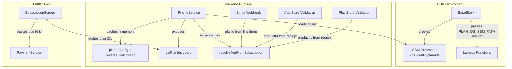

# Design Document: Plan ID Configuration

## Overview

This feature replaces the hardcoded `PLAN_TIER_MAP` in `PricingService` and the hardcoded plan ID strings in the Flutter `SubscriptionScreen` with a dynamic, SSM Parameter Store-backed configuration system. The configuration supports different product IDs per namespace (sandbox, beta, prod) and per payment platform (Stripe, App Store, Play Store).

Currently, the `PricingService` has:
```typescript
const PLAN_TIER_MAP: Record<string, Tier> = {
  'basic-monthly': Tier.BASIC,
  'pro-monthly': Tier.PRO,
};
```

And the Flutter `SubscriptionScreen` hardcodes `'basic-monthly'` and `'pro-monthly'` when building tier cards.

After this feature, plan IDs will be loaded from `/<namespace>/config/plan-ids` in SSM Parameter Store, and the Flutter app will fetch platform-specific plan IDs from a new `getPlanIds` GraphQL query.

### Design Decisions

1. **Single SSM parameter with JSON** rather than one parameter per plan ID — reduces SSM API calls and keeps the configuration atomic (all plan IDs update together).
2. **In-memory caching** of the loaded config — avoids repeated SSM calls on every tier resolution. Lambda cold starts will load once; warm invocations reuse the cache.
3. **Flat reverse-lookup map** built at load time — the JSON config is structured by platform/tier for human readability, but at runtime we build a single `Record<string, Tier>` that maps any product ID (from any platform) to its tier. This keeps `resolveTierFromSubscription` unchanged in its interface.
4. **GraphQL query for frontend** — the Flutter app fetches plan IDs from the backend rather than embedding them in app config, so plan ID changes don't require app releases.
5. **CDK provisions placeholder values** — new namespaces get a parameter with `CONFIGURE_ME_*` placeholders. The parameter uses `valueForStringParameter` lookup (not hardcoded in CDK) on subsequent deploys to avoid overwriting manually configured production values.

## Architecture



### Data Flow

1. **Deployment**: CDK `BaseStack` creates the SSM parameter with placeholder JSON. Operator configures real IDs per namespace.
2. **Lambda cold start**: `PricingService.initialize()` reads the SSM parameter, parses the JSON, and builds a reverse-lookup map (`productId → Tier`).
3. **Tier resolution**: `resolveTierFromSubscription` uses the reverse-lookup map instead of the hardcoded `PLAN_TIER_MAP`.
4. **Frontend**: `SubscriptionScreen` calls `getPlanIds(platform: STRIPE | APPLE_APP_STORE | GOOGLE_PLAY_STORE)` and receives `{ basicPlanId, proPlanId }`.
5. **Receipt validation**: App Store validation extracts `product_id` from `latest_receipt_info` and stores it as `planId`. Play Store validation already uses `input.productId`.

## Components and Interfaces

### 1. PlanIdConfig (Data Structure)

```typescript
/** JSON structure stored in SSM */
interface PlanIdConfig {
  stripe: { basic: string; pro: string };
  appStore: { basic: string; pro: string };
  playStore: { basic: string; pro: string };
}
```

### 2. PlanIdConfigLoader (New Module)

New file: `backend/src/services/plan-id-config-loader.ts`

```typescript
interface PlanIdConfigLoader {
  /** Load and parse the plan ID config from SSM */
  loadConfig(ssmPath: string): Promise<PlanIdConfig>;
  
  /** Build a reverse-lookup map from any product ID to its Tier */
  buildReverseLookupMap(config: PlanIdConfig): Record<string, Tier>;
  
  /** Validate that a PlanIdConfig has all required fields */
  validateConfig(raw: unknown): PlanIdConfig | null;
}
```

This module contains pure functions for parsing, validating, and transforming the config. The SSM fetch is isolated so the pure logic is testable.

### 3. PricingService (Modified)

Changes to `backend/src/services/pricing-service.ts`:

- Remove hardcoded `PLAN_TIER_MAP`
- Add `private planTierMap: Record<string, Tier>` instance field
- Add `private planIdConfig: PlanIdConfig | null` instance field
- Add `async initialize(): Promise<void>` — loads config from SSM, builds reverse map
- Add `getPlanIds(platform: PaymentProvider): { basicPlanId: string; proPlanId: string }` — returns plan IDs for a given platform
- Modify `resolveTierFromSubscription` to use the loaded `planTierMap` instead of the hardcoded constant

### 4. GraphQL Schema (Modified)

New types and query in `schema.graphql`:

```graphql
type PlanIds @aws_cognito_user_pools {
  basicPlanId: String!
  proPlanId: String!
}

type PlanIdsResponse @aws_cognito_user_pools {
  success: Boolean!
  planIds: PlanIds
  error: String
}

extend type Query {
  getPlanIds(platform: PaymentProvider!): PlanIdsResponse @aws_cognito_user_pools
}
```

### 5. getPlanIds Lambda (New)

New file: `backend/src/gql-lambda-functions/Query.getPlanIds.ts`

Receives a `platform` argument, calls `PricingService.getPlanIds(platform)`, returns the plan IDs.

### 6. App Store Receipt Validation (Modified)

Changes to `backend/src/gql-lambda-functions/Mutation.validateAppStoreReceipt.ts`:

- Extract `product_id` from the validated receipt's `latest_receipt_info`
- Store it as `planId` in the subscription record instead of the hardcoded `'appstore-subscription'`

### 7. CDK BaseStack (Modified)

Changes to `backend/lib/base-stack.ts`:

- Add SSM `StringParameter` at `/<namespace>/config/plan-ids` with default placeholder JSON
- Export the parameter path as a public property

### 8. CDK APIStack (Modified)

Changes to `backend/lib/api-stack.ts`:

- Add `PLAN_IDS_SSM_PATH` environment variable to all Lambda functions that use `PricingService`
- Grant SSM `GetParameter` permission for the plan-ids parameter to those Lambda functions
- Add new `getPlanIds` Lambda function and resolver

### 9. Flutter SubscriptionScreen (Modified)

Changes to `frontend/src/lib/screens/subscription_screen.dart`:

- On load, call `getPlanIds` query with the detected platform
- Store fetched plan IDs in state
- Pass fetched plan IDs to `_buildTierCard` instead of hardcoded strings
- Show error and disable purchase buttons if the query fails

### 10. Flutter SubscriptionProvider (Modified)

Changes to `frontend/src/lib/providers/subscription_provider.dart`:

- Add `loadPlanIds(platform)` method that calls the `getPlanIds` GraphQL query
- Expose `basicPlanId` and `proPlanId` getters

## Data Models

### SSM Parameter Value (JSON)

Path: `/<namespace>/config/plan-ids`

```json
{
  "stripe": {
    "basic": "price_stripe_basic_xxx",
    "pro": "price_stripe_pro_xxx"
  },
  "appStore": {
    "basic": "com.app.basic.monthly",
    "pro": "com.app.pro.monthly"
  },
  "playStore": {
    "basic": "com.app.basic.monthly",
    "pro": "com.app.pro.monthly"
  }
}
```

### Placeholder Default (CDK)

```json
{
  "stripe": {
    "basic": "CONFIGURE_ME_stripe_basic",
    "pro": "CONFIGURE_ME_stripe_pro"
  },
  "appStore": {
    "basic": "CONFIGURE_ME_appstore_basic",
    "pro": "CONFIGURE_ME_appstore_pro"
  },
  "playStore": {
    "basic": "CONFIGURE_ME_playstore_basic",
    "pro": "CONFIGURE_ME_playstore_pro"
  }
}
```

### Reverse Lookup Map (Runtime)

Built from the config at initialization:

```typescript
// For a prod namespace:
{
  "price_stripe_basic_xxx": Tier.BASIC,
  "price_stripe_pro_xxx": Tier.PRO,
  "com.app.basic.monthly": Tier.BASIC,
  "com.app.pro.monthly": Tier.PRO,
}
```

Note: If different platforms share the same product ID string for different tiers, the last one wins. The config should use unique IDs per platform — this is enforced by validation.

### GraphQL Response

```graphql
# Query
getPlanIds(platform: STRIPE) {
  success
  planIds {
    basicPlanId   # "price_stripe_basic_xxx"
    proPlanId     # "price_stripe_pro_xxx"
  }
  error
}
```

### Modified Subscription Record

No schema change needed. The `planId` field on `Subscription` already exists as `string?`. The change is that App Store subscriptions will now store the actual product ID (e.g., `com.app.basic.monthly`) instead of the hardcoded `'appstore-subscription'`.


## Correctness Properties

*A property is a characteristic or behavior that should hold true across all valid executions of a system — essentially, a formal statement about what the system should do. Properties serve as the bridge between human-readable specifications and machine-verifiable correctness guarantees.*

### Property 1: Config structure validation round-trip

*For any* JSON object, if `validateConfig` accepts it (returns non-null), then the result must have all three platform keys (`stripe`, `appStore`, `playStore`) each containing both `basic` and `pro` string entries. Conversely, *for any* JSON object missing any of these required keys, `validateConfig` must return null.

**Validates: Requirements 1.1, 1.2, 1.4**

### Property 2: Config load and tier resolution round-trip

*For any* valid `PlanIdConfig` with unique product IDs across all platforms, building the reverse-lookup map and then resolving the tier for each configured product ID shall return the expected tier (`BASIC` for basic entries, `PRO` for pro entries).

**Validates: Requirements 2.2, 3.1, 3.2, 3.3, 3.4, 3.6**

### Property 3: Malformed config rejection

*For any* string that is not valid JSON, or any JSON object that is missing required platform/tier keys, or any config where a plan ID value is not a non-empty string, `validateConfig` shall return null.

**Validates: Requirements 2.4**

### Property 4: Unknown plan ID fallback to FREE

*For any* valid `PlanIdConfig` and *for any* product ID string that does not appear in any platform entry of that config, resolving the tier using the reverse-lookup map shall return `FREE`.

**Validates: Requirements 3.5**

### Property 5: getPlanIds returns correct platform-specific IDs

*For any* valid `PlanIdConfig` and *for any* payment platform (Stripe, App Store, Play Store), calling `getPlanIds(platform)` shall return the `basicPlanId` and `proPlanId` that match the corresponding entries in the config for that platform.

**Validates: Requirements 2.5, 6.1**

## Error Handling

| Scenario | Behavior |
|---|---|
| SSM parameter missing | `PricingService.initialize()` logs error, sets `planTierMap` to empty `{}`. All plan IDs resolve to FREE. |
| SSM parameter contains invalid JSON | `validateConfig` returns null. Same fallback as missing parameter. |
| SSM parameter has partial config (e.g., missing `playStore`) | `validateConfig` returns null. Same fallback. |
| Plan ID value is empty string or non-string | `validateConfig` returns null. Same fallback. |
| `getPlanIds` called before `initialize()` | Returns error response: `{ success: false, error: "Plan ID configuration not loaded" }`. |
| `getPlanIds` called with invalid platform | Returns error response: `{ success: false, error: "Invalid platform" }`. |
| Flutter `getPlanIds` query fails (network error, backend error) | `SubscriptionScreen` shows error message, disables purchase buttons. |
| Duplicate product IDs across platforms in config | `validateConfig` should reject configs where the same product ID maps to different tiers. If same ID maps to same tier, it's allowed (e.g., same product ID on App Store and Play Store). |

## Testing Strategy

### Property-Based Tests (Vitest + fast-check)

The feature's core logic — config validation, reverse-map building, tier resolution, and plan ID retrieval — consists of pure functions with clear input/output behavior and a large input space (arbitrary strings as product IDs, arbitrary config structures). Property-based testing is well-suited here.

Library: `fast-check` (already used in the project)
Framework: `vitest` (already used in the project)
File: `backend/test/plan-id-config.property.test.ts`

Each property test must:
- Run a minimum of 100 iterations
- Reference its design document property in a comment tag
- Tag format: **Feature: plan-id-configuration, Property {number}: {property_text}**

Properties to implement:
1. **Property 1** — Generate random valid/invalid config objects, verify `validateConfig` accepts/rejects correctly
2. **Property 2** — Generate random valid configs with unique product IDs, build reverse map, resolve each ID, verify correct tier
3. **Property 3** — Generate random malformed inputs (bad JSON, missing keys, non-string values), verify `validateConfig` returns null
4. **Property 4** — Generate random valid configs and random strings not in the config, verify resolution returns FREE
5. **Property 5** — Generate random valid configs, call `getPlanIds` for each platform, verify correct IDs returned

### Unit Tests (Example-Based)

File: `backend/test/plan-id-config.test.ts`

- App Store receipt validation extracts product ID from `latest_receipt_info` (Requirement 4.1)
- Play Store validation stores `productId` from request (Requirement 5.1)
- Stripe checkout passes `planId` through to session creation (Requirement 7.1)
- Stripe webhook stores price ID from subscription line items (Requirement 7.2)
- `getPlanIds` returns error when config not loaded
- `getPlanIds` returns error for invalid platform

### CDK Snapshot/Assertion Tests

File: `backend/test/base-stack.spec.ts` (existing)

- SSM parameter created at `/<namespace>/config/plan-ids` (Requirement 8.1)
- Lambda environment variables include `PLAN_IDS_SSM_PATH` (Requirement 8.2)
- Default parameter value contains `CONFIGURE_ME` placeholders (Requirement 8.3)

File: `backend/test/api-stack.spec.ts` (existing)

- `getPlanIds` Lambda function created with correct environment variables
- SSM read permissions granted to pricing Lambda functions

### Integration Tests

- Flutter widget test: `SubscriptionScreen` calls `getPlanIds` on load (Requirement 6.2)
- Flutter widget test: fetched plan IDs passed to payment flow (Requirement 6.3)
- Flutter widget test: error state disables purchase buttons (Requirement 6.4)
