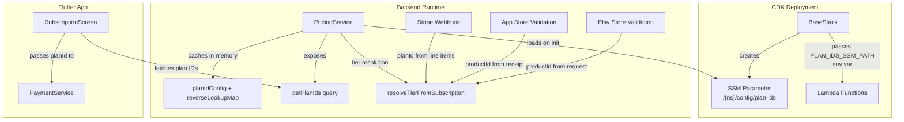

# Design Document: Plan ID Configuration

## Overview

This feature replaces the hardcoded `PLAN_TIER_MAP` in `PricingService` and the hardcoded plan ID strings in the Flutter `SubscriptionScreen` with a dynamic, SSM Parameter Store-backed configuration system. The configuration supports different product IDs per namespace (sandbox, beta, prod) and per payment platform (Stripe, App Store, Play Store).

Currently, the `PricingService` has:
```typescript
const PLAN_TIER_MAP: Record<string, Tier> = {
  'basic-monthly': Tier.BASIC,
  'pro-monthly': Tier.PRO,
};
```

And the Flutter `SubscriptionScreen` hardcodes `'basic-monthly'` and `'pro-monthly'` when building tier cards.

After this feature, plan IDs will be loaded from `/<namespace>/config/plan-ids` in SSM Parameter Store, and the Flutter app will fetch platform-specific plan IDs from a new `getPlanIds` GraphQL query.

### Design Decisions

1. **Single SSM parameter with JSON** rather than one parameter per plan ID — reduces SSM API calls and keeps the configuration atomic (all plan IDs update together).
2. **In-memory caching** of the loaded config — avoids repeated SSM calls on every tier resolution. Lambda cold starts will load once; warm invocations reuse the cache.
3. **Flat reverse-lookup map** built at load time — the JSON config is structured by platform/tier for human readability, but at runtime we build a single `Record<string, Tier>` that maps any product ID (from any platform) to its tier. This keeps `resolveTierFromSubscription` unchanged in its interface.
4. **GraphQL query for frontend** — the Flutter app fetches plan IDs from the backend rather than embedding them in app config, so plan ID changes don't require app releases.
5. **CDK provisions placeholder values** — new namespaces get a parameter with `CONFIGURE_ME_*` placeholders. The parameter uses `valueForStringParameter` lookup (not hardcoded in CDK) on subsequent deploys to avoid overwriting manually configured production values.

## Architecture



### Data Flow

1. **Deployment**: CDK `BaseStack` creates the SSM parameter with placeholder JSON. Operator configures real IDs per namespace.
2. **Lambda cold start**: `PricingService.initialize()` reads the SSM parameter, parses the JSON, and builds a reverse-lookup map (`productId → Tier`).
3. **Tier resolution**: `resolveTierFromSubscription` uses the reverse-lookup map instead of the hardcoded `PLAN_TIER_MAP`.
4. **Frontend**: `SubscriptionScreen` calls `getPlanIds(platform: STRIPE | APPLE_APP_STORE | GOOGLE_PLAY_STORE)` and receives `{ basicPlanId, proPlanId }`.
5. **Receipt validation**: App Store validation extracts `product_id` from `latest_receipt_info` and stores it as `planId`. Play Store validation already uses `input.productId`.

## Components and Interfaces

### 1. PlanIdConfig (Data Structure)

```typescript
/** JSON structure stored in SSM */
interface PlanIdConfig {
  stripe: { basic: string; pro: string };
  appStore: { basic: string; pro: string };
  playStore: { basic: string; pro: string };
}
```

### 2. PlanIdConfigLoader (New Module)

New file: `backend/src/services/plan-id-config-loader.ts`

```typescript
interface PlanIdConfigLoader {
  /** Load and parse the plan ID config from SSM */
  loadConfig(ssmPath: string): Promise<PlanIdConfig>;
  
  /** Build a reverse-lookup map from any product ID to its Tier */
  buildReverseLookupMap(config: PlanIdConfig): Record<string, Tier>;
  
  /** Validate that a PlanIdConfig has all required fields */
  validateConfig(raw: unknown): PlanIdConfig | null;
}
```

This module contains pure functions for parsing, validating, and transforming the config. The SSM fetch is isolated so the pure logic is testable.

### 3. PricingService (Modified)

Changes to `backend/src/services/pricing-service.ts`:

- Remove hardcoded `PLAN_TIER_MAP`
- Add `private planTierMap: Record<string, Tier>` instance field
- Add `private planIdConfig: PlanIdConfig | null` instance field
- Add `async initialize(): Promise<void>` — loads config from SSM, builds reverse map
- Add `getPlanIds(platform: PaymentProvider): { basicPlanId: string; proPlanId: string }` — returns plan IDs for a given platform
- Modify `resolveTierFromSubscription` to use the loaded `planTierMap` instead of the hardcoded constant

### 4. GraphQL Schema (Modified)

New types and query in `schema.graphql`:

```graphql
type PlanIds @aws_cognito_user_pools {
  basicPlanId: String!
  proPlanId: String!
}

type PlanIdsResponse @aws_cognito_user_pools {
  success: Boolean!
  planIds: PlanIds
  error: String
}

extend type Query {
  getPlanIds(platform: PaymentProvider!): PlanIdsResponse @aws_cognito_user_pools
}
```

### 5. getPlanIds Lambda (New)

New file: `backend/src/gql-lambda-functions/Query.getPlanIds.ts`

Receives a `platform` argument, calls `PricingService.getPlanIds(platform)`, returns the plan IDs.

### 6. App Store Receipt Validation (Modified)

Changes to `backend/src/gql-lambda-functions/Mutation.validateAppStoreReceipt.ts`:

- Extract `product_id` from the validated receipt's `latest_receipt_info`
- Store it as `planId` in the subscription record instead of the hardcoded `'appstore-subscription'`

### 7. CDK BaseStack (Modified)

Changes to `backend/lib/base-stack.ts`:

- Add SSM `StringParameter` at `/<namespace>/config/plan-ids` with default placeholder JSON
- Export the parameter path as a public property

### 8. CDK APIStack (Modified)

Changes to `backend/lib/api-stack.ts`:

- Add `PLAN_IDS_SSM_PATH` environment variable to all Lambda functions that use `PricingService`
- Grant SSM `GetParameter` permission for the plan-ids parameter to those Lambda functions
- Add new `getPlanIds` Lambda function and resolver

### 9. Flutter SubscriptionScreen (Modified)

Changes to `frontend/src/lib/screens/subscription_screen.dart`:

- On load, call `getPlanIds` query with the detected platform
- Store fetched plan IDs in state
- Pass fetched plan IDs to `_buildTierCard` instead of hardcoded strings
- Show error and disable purchase buttons if the query fails

### 10. Flutter SubscriptionProvider (Modified)

Changes to `frontend/src/lib/providers/subscription_provider.dart`:

- Add `loadPlanIds(platform)` method that calls the `getPlanIds` GraphQL query
- Expose `basicPlanId` and `proPlanId` getters

## Data Models

### SSM Parameter Value (JSON)

Path: `/<namespace>/config/plan-ids`

```json
{
  "stripe": {
    "basic": "price_stripe_basic_xxx",
    "pro": "price_stripe_pro_xxx"
  },
  "appStore": {
    "basic": "com.app.basic.monthly",
    "pro": "com.app.pro.monthly"
  },
  "playStore": {
    "basic": "com.app.basic.monthly",
    "pro": "com.app.pro.monthly"
  }
}
```

### Placeholder Default (CDK)

```json
{
  "stripe": {
    "basic": "CONFIGURE_ME_stripe_basic",
    "pro": "CONFIGURE_ME_stripe_pro"
  },
  "appStore": {
    "basic": "CONFIGURE_ME_appstore_basic",
    "pro": "CONFIGURE_ME_appstore_pro"
  },
  "playStore": {
    "basic": "CONFIGURE_ME_playstore_basic",
    "pro": "CONFIGURE_ME_playstore_pro"
  }
}
```

### Reverse Lookup Map (Runtime)

Built from the config at initialization:

```typescript
// For a prod namespace:
{
  "price_stripe_basic_xxx": Tier.BASIC,
  "price_stripe_pro_xxx": Tier.PRO,
  "com.app.basic.monthly": Tier.BASIC,
  "com.app.pro.monthly": Tier.PRO,
}
```

Note: If different platforms share the same product ID string for different tiers, the last one wins. The config should use unique IDs per platform — this is enforced by validation.

### GraphQL Response

```graphql
# Query
getPlanIds(platform: STRIPE) {
  success
  planIds {
    basicPlanId   # "price_stripe_basic_xxx"
    proPlanId     # "price_stripe_pro_xxx"
  }
  error
}
```

### Modified Subscription Record

No schema change needed. The `planId` field on `Subscription` already exists as `string?`. The change is that App Store subscriptions will now store the actual product ID (e.g., `com.app.basic.monthly`) instead of the hardcoded `'appstore-subscription'`.

