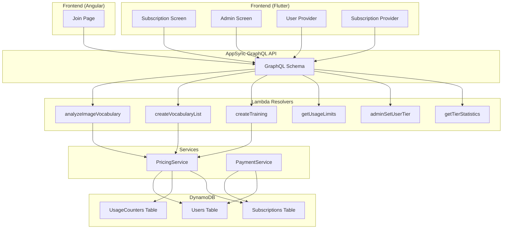

# Design Document: Pricing Structure

## Overview

This design introduces a three-tier pricing model (FREE, BASIC, PRO) into the Train with Joe vocabulary learning app. Currently the system has a binary subscription model (active/inactive). This feature adds:

- A `tier` field on the User model and a new `UsageCounter` record in DynamoDB
- A `PricingService` that resolves a user's tier from their subscription state and enforces usage limits at the API layer
- Updated GraphQL schema with tier enum, usage queries, and admin mutations
- Flutter subscription screen redesigned with three tier cards and usage indicators
- Angular join page updated with a pricing comparison section
- Admin screen extended with user tier management and tier statistics tabs

The design prioritizes backend enforcement so limits cannot be bypassed client-side, and keeps the pricing service as a pure logic layer that can be unit-tested independently of DynamoDB.

## Architecture



### Key Design Decisions

1. **Tier stored on User record**: The `tier` and `tierSource` fields are stored directly on the User item in DynamoDB. This avoids an extra lookup on every API call. The tier is updated reactively when subscription status changes (via webhook or receipt validation) or when an admin performs a manual override.

2. **Separate UsageCounters table**: Usage counters (image scans, vocabulary list count) are stored in a dedicated DynamoDB table keyed by `userId`. This keeps the User record clean and allows atomic counter increments via DynamoDB `ADD` expressions without read-modify-write races.

3. **PricingService as pure logic + repository**: The `PricingService` encapsulates all tier resolution and limit-checking logic. The pure functions (e.g., `getTierLimits`, `canPerformAction`) are separated from the repository calls, making them easy to property-test.

4. **Grace period via TTL**: When a subscription goes PAST_DUE, the user keeps their current tier for 7 days. This is tracked by storing a `gracePeriodEnd` timestamp on the User record. A scheduled check (or lazy evaluation on next API call) downgrades to FREE after expiry.

5. **Billing period reset**: For BASIC tier image scan counters, the reset happens lazily — when checking limits, the service compares the counter's `periodStart` against the subscription's `currentPeriodEnd`. If the period has rolled over, the counter resets.

## Components and Interfaces

### PricingService (`backend/src/services/pricing-service.ts`)

```typescript
export enum Tier {
  FREE = 'FREE',
  BASIC = 'BASIC',
  PRO = 'PRO',
}

export enum TierSource {
  SUBSCRIPTION = 'SUBSCRIPTION',
  MANUAL = 'MANUAL',
}

export interface TierLimits {
  maxImageScans: number | null;       // null = unlimited
  maxVocabularyLists: number | null;   // null = unlimited
  aiTrainingEnabled: boolean;
  imageScanPeriod: 'lifetime' | 'billing_period';
}

export interface UsageStatus {
  tier: Tier;
  imageScansUsed: number;
  imageScansLimit: number | null;
  vocabularyListsUsed: number;
  vocabularyListsLimit: number | null;
  aiTrainingEnabled: boolean;
}

// Pure functions (testable without DynamoDB)
function getTierLimits(tier: Tier): TierLimits;
function resolveTierFromSubscription(subscriptionStatus: string | undefined, planId: string | undefined, manualTier?: Tier, tierSource?: TierSource): { tier: Tier; tierSource: TierSource };
function canPerformImageScan(tier: Tier, currentCount: number, limits: TierLimits): boolean;
function canCreateVocabularyList(tier: Tier, currentCount: number, limits: TierLimits): boolean;
function canAccessAiTraining(tier: Tier): boolean;
function shouldResetPeriodCounter(periodStart: string, currentPeriodEnd: string): boolean;

// Service class (uses repositories)
class PricingService {
  checkImageScanLimit(userId: string): Promise<void>;  // throws UPGRADE_REQUIRED
  checkVocabularyListLimit(userId: string): Promise<void>;
  checkAiTrainingAccess(userId: string): Promise<void>;
  incrementImageScanCount(userId: string, count: number): Promise<void>;
  incrementVocabularyListCount(userId: string): Promise<void>;
  decrementVocabularyListCount(userId: string): Promise<void>;
  getUsageStatus(userId: string): Promise<UsageStatus>;
  setUserTier(userId: string, tier: Tier, source: TierSource): Promise<void>;
  resolveAndUpdateTier(userId: string): Promise<Tier>;
  getTierStatistics(): Promise<TierStatisticsResult>;
}
```

### UsageCounterRepository (`backend/src/repositories/usage-counter-repository.ts`)

```typescript
export interface UsageCounter {
  userId: string;
  imageScansCount: number;
  vocabularyListsCount: number;
  imageScanPeriodStart?: string;
  updatedAt: string;
}

class UsageCounterRepository {
  getByUserId(userId: string): Promise<UsageCounter | null>;
  incrementImageScans(userId: string, count: number): Promise<void>;
  incrementVocabularyLists(userId: string): Promise<void>;
  decrementVocabularyLists(userId: string): Promise<void>;
  resetImageScanCounter(userId: string, periodStart: string): Promise<void>;
}
```

### GraphQL Schema Additions

```graphql
enum Tier {
  FREE
  BASIC
  PRO
}

enum TierSource {
  SUBSCRIPTION
  MANUAL
}

type UsageLimits {
  tier: Tier!
  tierSource: TierSource!
  imageScansUsed: Int!
  imageScansLimit: Int
  vocabularyListsUsed: Int!
  vocabularyListsLimit: Int
  aiTrainingEnabled: Boolean!
}

type TierStatistic {
  tier: Tier!
  subscriptionCount: Int!
  manualCount: Int!
  totalCount: Int!
}

type TierStatisticsResponse {
  success: Boolean!
  statistics: [TierStatistic!]
  error: String
}

type UsageLimitsResponse {
  success: Boolean!
  usageLimits: UsageLimits
  error: String
}

# Added to User type:
#   tier: Tier
#   tierSource: TierSource

# New queries:
#   getUsageLimits: UsageLimitsResponse
#   getTierStatistics: TierStatisticsResponse  (admin only)

# New mutations:
#   adminSetUserTier(input: AdminSetUserTierInput!): UserResponse  (admin only)

input AdminSetUserTierInput {
  userId: ID!
  tier: Tier!
}
```

### CDK Changes (`backend/lib/base-stack.ts`)

- Add `UsageCounters` DynamoDB table with `userId` as partition key
- Export table name to SSM parameter store

### CDK Changes (`backend/lib/api-stack.ts`)

- Add Lambda resolvers for `getUsageLimits`, `adminSetUserTier`, `getTierStatistics`
- Pass `USAGE_COUNTERS_TABLE_NAME` and `USERS_TABLE_NAME` env vars to relevant Lambdas
- Grant read/write on UsageCounters table to image analysis, vocabulary, and training Lambdas

### Flutter Changes

- **`subscription_provider.dart`**: Add `loadUsageLimits()` method, expose `UsageLimits` model
- **`subscription_screen.dart`**: Redesign to show 3 tier cards (Free/$0, Basic/$2.99, Pro/$9.99) with feature lists and usage indicators
- **`user_provider.dart`**: Add `tier`, `tierSource` fields from User query; add `adminSetUserTier()` method
- **`admin_screen.dart`**: Add "Users" tab with tier display and override controls; add "Tier Stats" tab

### Angular Join Page Changes

- **`home.component.html`**: Add pricing section between features and registration sections with 3 pricing cards
- **`home.component.ts`**: Add scroll-to-pricing method


## Data Models

### User (extended)

```typescript
export interface User {
  id: string;
  email: string;
  name?: string;
  subscriptionStatus?: SubscriptionStatus;
  subscriptionProvider?: PaymentProvider;
  tier?: Tier;                    // NEW: FREE | BASIC | PRO
  tierSource?: TierSource;        // NEW: SUBSCRIPTION | MANUAL
  gracePeriodEnd?: string;        // NEW: ISO timestamp, set when PAST_DUE
  createdAt: string;
  updatedAt: string;
}
```

### UsageCounter (new)

```typescript
export interface UsageCounter {
  userId: string;                  // Partition key
  imageScansCount: number;         // Cumulative for FREE, per-period for BASIC
  vocabularyListsCount: number;    // Current count (incremented on create, decremented on delete)
  imageScanPeriodStart?: string;   // ISO timestamp — start of current billing period (BASIC only)
  updatedAt: string;
}
```

### Tier Limits Configuration

| Feature | FREE | BASIC | PRO |
|---------|------|-------|-----|
| Price | $0 | $2.99/mo | $9.99/mo |
| Vocabulary Lists | 5 total | Unlimited | Unlimited |
| Image Scans | 5 total | 25/billing period | Unlimited |
| AI Training | No | No | Yes |
| Image Scan Counter | Lifetime | Per billing period | N/A |

### Tier Resolution Logic

```
1. If user has tierSource === 'MANUAL' and no active subscription → use manual tier
2. If user has active subscription:
   a. planId maps to 'basic-monthly' → BASIC
   b. planId maps to 'pro-monthly' → PRO
   c. Otherwise → derive from planId prefix
3. If subscription is PAST_DUE and gracePeriodEnd > now → keep current tier
4. If subscription is PAST_DUE and gracePeriodEnd <= now → FREE
5. If subscription is CANCELLED/INACTIVE → FREE
6. If no subscription → FREE
7. If user purchases subscription while having manual override → subscription takes precedence
```

### Plan ID Mapping

```typescript
const PLAN_TIER_MAP: Record<string, Tier> = {
  'basic-monthly': Tier.BASIC,
  'pro-monthly': Tier.PRO,
};
```


## Correctness Properties

*A property is a characteristic or behavior that should hold true across all valid executions of a system — essentially, a formal statement about what the system should do. Properties serve as the bridge between human-readable specifications and machine-verifiable correctness guarantees.*

### Property 1: Tier resolution correctness

*For any* combination of subscription status (ACTIVE, INACTIVE, CANCELLED, PAST_DUE, undefined), plan ID (basic-monthly, pro-monthly, unknown, undefined), manual tier override, and tier source, the `resolveTierFromSubscription` function SHALL return the correct tier: BASIC for active basic plans, PRO for active pro plans, FREE for inactive/cancelled subscriptions, the manual tier when no active subscription exists and a manual override is set, and the subscription-based tier when an active subscription exists regardless of any manual override.

**Validates: Requirements 1.3, 1.4, 1.5, 10.3, 10.5**

### Property 2: Image scan limit enforcement

*For any* tier (FREE, BASIC, PRO) and any non-negative image scan count, `canPerformImageScan(tier, count, getTierLimits(tier))` SHALL return `true` if and only if the tier's image scan limit is null (unlimited) OR the count is strictly less than the tier's limit (5 for FREE, 25 for BASIC).

**Validates: Requirements 2.1, 2.5, 3.2, 3.5, 4.2**

### Property 3: Vocabulary list limit enforcement

*For any* tier (FREE, BASIC, PRO) and any non-negative vocabulary list count, `canCreateVocabularyList(tier, count, getTierLimits(tier))` SHALL return `true` if and only if the tier's vocabulary list limit is null (unlimited) OR the count is strictly less than the tier's limit (5 for FREE). This holds even when a downgraded FREE user has more than 5 existing lists — creation is blocked but existing lists are accessible.

**Validates: Requirements 2.2, 2.4, 3.1, 4.1, 9.3**

### Property 4: Image scan counter increment

*For any* initial non-negative image scan count and any positive increment amount, after calling `incrementImageScans(userId, amount)`, the resulting image scan count SHALL equal the initial count plus the increment amount.

**Validates: Requirements 8.1**

### Property 5: Vocabulary list counter round-trip

*For any* initial non-negative vocabulary list count, incrementing the counter by 1 and then decrementing it by 1 SHALL return the counter to its original value.

**Validates: Requirements 8.2, 8.3**

### Property 6: Data preservation on tier transition

*For any* user with existing vocabulary lists and image scan history, changing the user's tier (upgrade or downgrade) SHALL not modify, delete, or alter any existing vocabulary lists or image scan counter values. The count of vocabulary lists before and after the tier change SHALL be identical.

**Validates: Requirements 9.1, 9.2**

### Property 7: Grace period enforcement

*For any* user with a PAST_DUE subscription status and a `gracePeriodEnd` timestamp, the effective tier SHALL equal the user's pre-PAST_DUE tier when the current time is before `gracePeriodEnd`, and SHALL equal FREE when the current time is at or after `gracePeriodEnd`.

**Validates: Requirements 9.5**

### Property 8: Billing period counter reset

*For any* `imageScanPeriodStart` timestamp and `currentPeriodEnd` timestamp, `shouldResetPeriodCounter(periodStart, currentPeriodEnd)` SHALL return `true` if and only if `periodStart` is before `currentPeriodEnd` minus one billing period (i.e., the period has rolled over), ensuring BASIC tier image scan counters reset correctly at billing boundaries.

**Validates: Requirements 3.4**

## Error Handling

### UPGRADE_REQUIRED Error

When a usage limit check fails, the PricingService throws a structured error:

```typescript
class UpgradeRequiredError extends Error {
  code: 'UPGRADE_REQUIRED';
  currentTier: Tier;
  requiredTier: Tier;      // minimum tier needed
  limitType: 'IMAGE_SCAN' | 'VOCABULARY_LIST' | 'AI_TRAINING';
  currentUsage?: number;
  limit?: number;
}
```

Lambda resolvers catch this error and return it as a GraphQL response:

```json
{
  "success": false,
  "error": "Free tier limit reached: 5/5 image scans used. Upgrade to Basic or Pro for more.",
  "errorCode": "UPGRADE_REQUIRED"
}
```

### Error Scenarios

| Scenario | Error Code | Message Pattern |
|----------|-----------|-----------------|
| FREE user exceeds 5 image scans | UPGRADE_REQUIRED | "Free tier limit reached: X/5 image scans used" |
| FREE user exceeds 5 vocabulary lists | UPGRADE_REQUIRED | "Free tier limit reached: X/5 vocabulary lists" |
| FREE/BASIC user attempts AI training | UPGRADE_REQUIRED | "AI training requires Pro tier" |
| BASIC user exceeds 25 image scans/period | UPGRADE_REQUIRED | "Basic tier limit reached: X/25 image scans this period" |
| Non-admin calls adminSetUserTier | UNAUTHORIZED | "Admin access required" |
| Non-admin calls getTierStatistics | UNAUTHORIZED | "Admin access required" |

### Counter Edge Cases

- If `decrementVocabularyLists` would result in a negative count, clamp to 0
- If `UsageCounter` record doesn't exist, treat all counters as 0 (create on first increment)
- If `imageScanPeriodStart` is missing for a BASIC user, treat as needing reset

## Testing Strategy

### Property-Based Tests (fast-check)

The project uses TypeScript with Jest. Property-based tests will use `fast-check` (already available in the Node.js ecosystem) with minimum 100 iterations per property.

Each property test maps to a design property:

| Test File | Properties Covered |
|-----------|-------------------|
| `backend/test/pricing-service.property.test.ts` | Properties 1–3, 7–8 |
| `backend/test/usage-counter.property.test.ts` | Properties 4–6 |

Property tests focus on the pure functions in PricingService (`getTierLimits`, `resolveTierFromSubscription`, `canPerformImageScan`, `canCreateVocabularyList`, `shouldResetPeriodCounter`) and the counter arithmetic.

Tag format: `Feature: pricing-structure, Property N: <title>`

### Unit Tests

| Test File | Coverage |
|-----------|----------|
| `backend/test/pricing-service.test.ts` | AI training access per tier (2.3, 3.3, 4.3), error structure (5.4), default tier assignment (1.2), missing counter defaults (8.5) |
| `backend/test/admin-tier-management.test.ts` | Admin authorization (10.6), tier statistics query (11.3) |

### Integration Tests

| Test | Coverage |
|------|----------|
| Lambda resolver integration | Verify analyzeImageVocabulary, createVocabularyList, createTraining call PricingService before proceeding (5.1, 5.2, 5.3) |
| GraphQL schema validation | Verify tier field on User type, getUsageLimits query, adminSetUserTier mutation exist (1.6, 5.5) |

### Frontend Tests

| Test | Coverage |
|------|----------|
| Flutter widget tests | Subscription screen tier cards (6.1–6.5), admin screen tabs (10.1, 10.2, 10.7, 11.1, 11.2, 11.4) |
| Angular component tests | Join page pricing section (7.1–7.6) |
