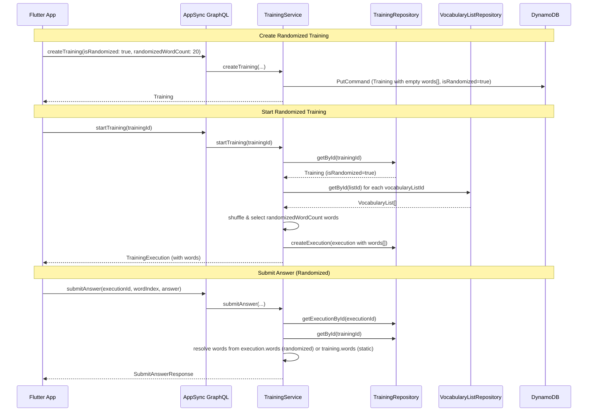

# Design Document: Randomized Training

## Overview

This feature extends the existing training system to support a "randomized" mode where words are dynamically selected from attached vocabulary lists each time a training execution starts, rather than being fixed at training creation time.

Currently, `createTraining` fetches words from vocabulary lists, shuffles, selects up to `wordCount`, and stores them on the `Training` entity. Every `startTraining` call reuses those same words. With randomized training, the `Training` entity stores only configuration (vocabulary list IDs, randomized word count) and defers word selection to `startTraining`, which fetches fresh words from the vocabulary lists each time.

The key design decision is where to store the dynamically selected words. Since `submitAnswer` currently looks up words via `training.words[wordIndex]`, randomized executions need their own word list. We store the selected words on the `TrainingExecution` entity, and `submitAnswer` reads from the execution's words when the training is randomized.

## Architecture

The change is localized to the training domain. No new Lambda functions, DynamoDB tables, or CDK stack changes are required.



### Design Decisions

1. **Words on TrainingExecution, not a separate table**: Storing selected words directly on the `TrainingExecution` entity avoids adding a new DynamoDB table or GSI. The word list per execution is small (max 100 items) and fits comfortably in a single DynamoDB item.

2. **Empty `words[]` on randomized Training**: A randomized `Training` stores `words: []` to keep the schema consistent. The `isRandomized` flag distinguishes behavior.

3. **`submitAnswer` dual-path lookup**: For static trainings, words come from `training.words[wordIndex]` (existing behavior). For randomized trainings, words come from `execution.words[wordIndex]`. This is the minimal change to support both modes.

4. **No unit filtering at start time**: The current `createTraining` supports `units` filtering. For randomized trainings, unit filtering is applied at creation time by storing the selected units on the Training, and filtering is re-applied at each `startTraining`. This keeps the randomized selection consistent with the user's original intent.

## Components and Interfaces

### Modified Domain Model: Training

```typescript
// backend/src/model/domain/Training.ts — additions
export interface Training {
  // ... existing fields ...
  isRandomized?: boolean;          // true for randomized mode, undefined/false for static
  randomizedWordCount?: number;    // number of words to select per execution (1-100)
  units?: string[];                // stored unit filter for randomized re-selection
}
```

### Modified Domain Model: TrainingExecution

```typescript
// backend/src/model/domain/Training.ts — additions
export interface TrainingExecution {
  // ... existing fields ...
  words?: TrainingWord[];  // populated for randomized training executions
}
```

### Modified Service: TrainingService

**`createTraining`** — new parameters: `isRandomized?: boolean`, `randomizedWordCount?: number`
- If `isRandomized` is true:
  - Validate `randomizedWordCount` (default 10, cap at 100, reject < 1)
  - Store `words: []`, `isRandomized: true`, `randomizedWordCount`, and `units` on the Training
  - Do NOT fetch or select words from vocabulary lists
- If `isRandomized` is false/undefined: existing behavior unchanged

**`startTraining`** — branching logic:
- If `training.isRandomized`:
  - Fetch current words from all `training.vocabularyListIds` (skip deleted lists)
  - Filter by `training.units` if present
  - Shuffle and select up to `training.randomizedWordCount` words
  - Error if no words available
  - Error if MULTIPLE_CHOICE mode and fewer than 3 words selected
  - Store selected words on the `TrainingExecution`
  - Generate multiple choice options from execution words (not training words)
- If not randomized: existing behavior unchanged

**`submitAnswer`** — dual-path word resolution:
- Fetch training to check `isRandomized`
- If randomized: use `execution.words[wordIndex]`
- If static: use `training.words[wordIndex]` (existing behavior)

### Modified GraphQL Schema

```graphql
# Training type — add fields
type Training @aws_cognito_user_pools {
  # ... existing fields ...
  isRandomized: Boolean
  randomizedWordCount: Int
}

# CreateTrainingInput — add fields
input CreateTrainingInput @aws_cognito_user_pools {
  # ... existing fields ...
  isRandomized: Boolean
  randomizedWordCount: Int
}

# TrainingExecution type — add words field
type TrainingExecution @aws_cognito_user_pools {
  # ... existing fields ...
  words: [TrainingWord!]
}
```

### Modified Lambda Resolver: Mutation.createTraining

Pass `isRandomized` and `randomizedWordCount` from `event.arguments.input` to `TrainingService.createTraining`.

### Modified Frontend: training_provider.dart

- `createTraining` method: accept optional `isRandomized` and `randomizedWordCount` parameters, include in mutation input
- `startTraining` method: update GraphQL query to fetch `execution.words` field
- `loadTrainings` / `getTraining`: update queries to fetch `isRandomized` and `randomizedWordCount`

### Frontend UI Changes

- Training creation screen: add a toggle for randomized mode and a numeric input for word count
- Training list: show a visual indicator (e.g., shuffle icon) for randomized trainings
- Training detail: show randomized word count and vocabulary list count instead of a fixed word list

## Data Models

### Training Entity (DynamoDB)

| Field | Type | Notes |
|---|---|---|
| id | string | Partition key |
| userId | string | GSI: userId-index |
| name | string | |
| mode | 'TEXT_INPUT' \| 'MULTIPLE_CHOICE' | |
| direction | 'WORD_TO_TRANSLATION' \| 'TRANSLATION_TO_WORD' | |
| vocabularyListIds | string[] | |
| words | TrainingWord[] | Empty array for randomized trainings |
| isRandomized | boolean? | New field. Undefined = static (backward compat) |
| randomizedWordCount | number? | New field. 1-100, default 10 |
| units | string[]? | New field. Stored for re-filtering at start time |
| createdAt | string | ISO 8601 |
| updatedAt | string | ISO 8601 |

### TrainingExecution Entity (DynamoDB)

| Field | Type | Notes |
|---|---|---|
| id | string | Partition key |
| trainingId | string | GSI: trainingId-index |
| userId | string | |
| startedAt | string | ISO 8601 |
| completedAt | string? | |
| abortedAt | string? | |
| results | TrainingResult[] | |
| multipleChoiceOptions | MultipleChoiceOption[]? | |
| words | TrainingWord[]? | New field. Populated for randomized executions |
| correctCount | number | |
| incorrectCount | number | |

No new tables or GSIs are needed. The existing single-table design in the trainings table accommodates both Training and TrainingExecution items.


## Correctness Properties

*A property is a characteristic or behavior that should hold true across all valid executions of a system — essentially, a formal statement about what the system should do. Properties serve as the bridge between human-readable specifications and machine-verifiable correctness guarantees.*

### Property 1: Randomized training creation stores configuration correctly

*For any* valid `isRandomized=true` training creation with valid vocabulary list IDs and a valid `randomizedWordCount`, the resulting Training entity SHALL have `isRandomized=true`, the specified `randomizedWordCount`, an empty `words` array, and `vocabularyListIds` matching the input.

**Validates: Requirements 1.1, 1.2**

### Property 2: Word count validation and capping

*For any* randomized training creation, if `randomizedWordCount > 100` the stored value SHALL be 100, and if `randomizedWordCount < 1` the request SHALL be rejected with an error. For values in `[1, 100]`, the stored value SHALL equal the input.

**Validates: Requirements 1.4, 1.5**

### Property 3: Dynamic word selection produces a correct subset

*For any* randomized training with attached vocabulary lists containing words with translations, starting the training SHALL produce a `TrainingExecution` whose `words` are a subset of the union of all available vocabulary words, with `words.length == min(randomizedWordCount, totalAvailableWords)`.

**Validates: Requirements 2.1, 2.2, 2.3, 2.6**

### Property 4: Deleted vocabulary lists are skipped during word selection

*For any* randomized training where some attached vocabulary lists have been deleted, starting the training SHALL select words only from the remaining (non-deleted) lists, and no word in the execution SHALL reference a deleted list's ID.

**Validates: Requirements 2.4**

### Property 5: Static training backward compatibility

*For any* training created without `isRandomized` (or with `isRandomized=false`), the Training entity SHALL have a non-empty `words` array pre-selected at creation time, and starting the training SHALL use those pre-stored words — identical to existing behavior.

**Validates: Requirements 3.1, 3.3**

### Property 6: Multiple choice options generated from dynamically selected words

*For any* randomized training in MULTIPLE_CHOICE mode with at least 3 dynamically selected words, starting the training SHALL produce multiple choice options where each option set contains the correct answer and distractors drawn exclusively from the execution's selected words.

**Validates: Requirements 7.1**

## Error Handling

| Scenario | Behavior | Error Message |
|---|---|---|
| `randomizedWordCount < 1` | Reject creation | "Randomized word count must be at least 1" |
| All attached vocabulary lists deleted or empty at start time | Reject start, no execution created | "No words available from the selected vocabulary lists" |
| Randomized MULTIPLE_CHOICE with < 3 words available | Reject start, no execution created | "Multiple-choice requires at least 3 words" |
| Vocabulary list fetch fails (DynamoDB error) | Reject start with error | "Failed to start training: {error}" |
| `submitAnswer` with invalid `wordIndex` for randomized execution | Reject answer | "Invalid word index" |
| Training not found | Reject with 404-style error | "Training not found" |
| User not authorized | Reject with auth error | "Not authorized" |

Error responses follow the existing `{ success: false, error: string }` pattern used throughout the codebase.

## Testing Strategy

### Unit Tests (Example-Based)

- Default `randomizedWordCount` to 10 when not specified (Req 1.3)
- Static training start uses `training.words` (Req 3.2)
- All lists deleted returns error (Req 2.5)
- MULTIPLE_CHOICE with < 3 words returns error (Req 7.2)
- GraphQL schema contains new fields (Req 4.1–4.5)
- `submitAnswer` resolves words from `execution.words` for randomized trainings

### Property-Based Tests

Property-based tests use `fast-check` (already in the project) with the existing `aws-sdk-client-mock` pattern for DynamoDB mocking, consistent with `backend/test/training-service.property.test.ts`.

- Minimum 100 iterations per property test
- Each test tagged with: **Feature: randomized-training, Property {number}: {title}**
- Tests target `TrainingService` methods with mocked DynamoDB calls

| Property | Test Description | Key Arbitraries |
|---|---|---|
| Property 1 | Create randomized training, verify stored config | `fc.uuid()`, `fc.integer({min:1, max:100})`, vocab list ID arrays |
| Property 2 | Create with out-of-range word counts, verify capping/rejection | `fc.integer({min:101, max:10000})`, `fc.integer({min:-100, max:0})` |
| Property 3 | Start randomized training, verify word subset and count | Vocab lists with random words, `fc.integer({min:1, max:100})` for word count |
| Property 4 | Start with mix of existing/deleted lists, verify no deleted-list words | Vocab list IDs partitioned into existing and deleted |
| Property 5 | Create static training, verify words pre-selected | Same arbitraries as existing training creation tests |
| Property 6 | Start randomized MC training, verify options from execution words | Vocab lists with ≥3 words, mode=MULTIPLE_CHOICE |

### Frontend Tests

- Widget tests for the randomized toggle and word count input
- Widget tests for visual indicator in training list
- Widget tests for detail view showing word count vs. word list
- Integration tests verifying GraphQL mutation payloads include/omit randomized fields
