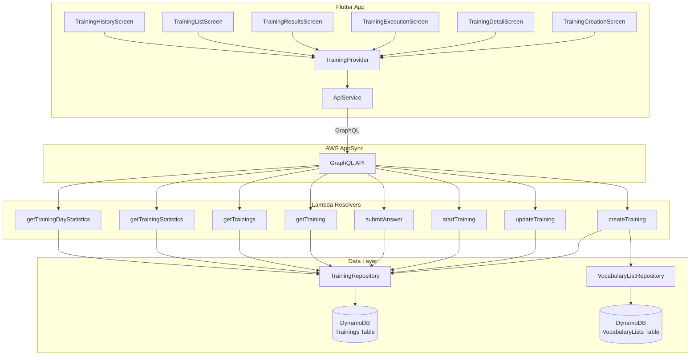

# Design Document: Vocabulary Training

## Overview

The Vocabulary Training feature enables users to create reusable training sessions from their existing vocabulary lists, practice translations via text-input or multiple-choice modes, and review historical results with statistics. The feature spans the full stack: new DynamoDB tables and a repository for persistence, a training service for business logic, new GraphQL mutations/queries in AppSync, Lambda resolvers, a Flutter provider for state management, and six new Flutter screens.

### Key Design Decisions

1. **Single DynamoDB table for Trainings with embedded executions**: Training_Executions are stored as separate items in the same table, keyed by `trainingId` via a GSI. This avoids a second table while keeping queries efficient.
2. **Lambda-backed resolvers for all training operations**: Training logic (creating from vocabulary lists, answer validation, statistics computation) is too complex for direct DynamoDB resolvers. All training GraphQL operations use Lambda resolvers, consistent with the vocabulary list pattern.
3. **Stateless execution model**: The backend does not maintain in-progress execution state. The Flutter app drives the execution flow, submitting answers one at a time. The backend records results and computes the final state when all answers are submitted.
4. **Multiple-choice options generated server-side**: When starting a MULTIPLE_CHOICE training execution, the backend generates shuffled options for each word and returns them with the execution. This prevents the client from seeing correct answers before they're needed.

## Architecture



## Components and Interfaces

### Backend Components

#### 1. Domain Models (`backend/src/model/domain/Training.ts`)

New TypeScript interfaces for Training, TrainingExecution, TrainingWord, and TrainingResult.

#### 2. Training Repository (`backend/src/repositories/training-repository.ts`)

Singleton repository following the existing pattern (UserRepository, VocabularyListRepository). Provides:
- `create(training)` — persist a new Training
- `getById(id)` — fetch Training by ID
- `getAllByUserId(userId)` — query via GSI `userId-index`
- `update(id, updates)` — partial update
- `delete(id)` — remove Training
- `createExecution(execution)` — persist a TrainingExecution
- `getExecutionById(id)` — fetch execution by ID
- `getExecutionsByTrainingId(trainingId)` — query via GSI `trainingId-index`
- `updateExecution(id, updates)` — partial update execution

#### 3. Training Service (`backend/src/services/training-service.ts`)

Singleton service encapsulating business logic:
- `createTraining(userId, vocabularyListIds, mode)` — fetches vocabulary lists, validates, creates Training
- `updateTraining(trainingId, userId, words)` — validates minimum word count, updates word list
- `startTraining(trainingId, userId)` — creates execution, generates MC options if needed
- `submitAnswer(executionId, userId, wordIndex, answer)` — records result, computes correctness
- `getTraining(trainingId, userId)` — returns Training with executions
- `getTrainings(userId)` — returns all user trainings
- `getTrainingStatistics(trainingId, userId)` — computes accuracy, trends, per-word stats
- `getTrainingDayStatistics(userId, date)` — returns executions for a specific date

#### 4. Lambda Resolvers (`backend/src/gql-lambda-functions/`)

Eight new Lambda functions, one per GraphQL operation:
- `Mutation.createTraining.ts`
- `Mutation.updateTraining.ts`
- `Mutation.startTraining.ts`
- `Mutation.submitAnswer.ts`
- `Query.getTraining.ts`
- `Query.getTrainings.ts`
- `Query.getTrainingStatistics.ts`
- `Query.getTrainingDayStatistics.ts`

Each follows the existing pattern: extract `event.identity.sub` for userId, delegate to TrainingService, return response.

#### 5. GraphQL Schema Extensions (`backend/src/gql-schemas/schema.graphql`)

New enums, types, inputs, and response types added to the existing schema.

#### 6. CDK Stack Updates (`backend/lib/api-stack.ts`, `backend/lib/base-stack.ts`)

- BaseStack: new `trainingsTable` DynamoDB table with GSIs for `userId` and `trainingId`
- APIStack: new Lambda functions, data sources, and resolvers for all training operations

### Frontend Components

#### 7. Training Provider (`frontend/src/lib/providers/training_provider.dart`)

ChangeNotifier provider following the VocabularyProvider pattern. Manages training state, communicates with GraphQL API via ApiService.

#### 8. Flutter Screens

Six new screens under `frontend/src/lib/screens/`:
- `training_creation_screen.dart` — select vocabulary lists and mode, create training
- `training_detail_screen.dart` — view/edit words, start training
- `training_execution_screen.dart` — answer prompts one at a time
- `training_results_screen.dart` — post-execution summary
- `training_list_screen.dart` — list all user trainings
- `training_history_screen.dart` — past executions and statistics

#### 9. Router Updates (`frontend/src/lib/main.dart`)

New routes: `/trainings`, `/trainings/create`, `/trainings/:id`, `/trainings/:id/execute/:executionId`, `/trainings/:id/results/:executionId`, `/trainings/:id/history`


## Data Models

### Training

```typescript
export type TrainingMode = 'TEXT_INPUT' | 'MULTIPLE_CHOICE';

export interface TrainingWord {
  word: string;
  translation: string;
  vocabularyListId: string;
}

export interface Training {
  id: string;                        // Partition key
  userId: string;                    // GSI partition key (userId-index)
  name: string;                      // Auto-generated or user-provided
  mode: TrainingMode;
  vocabularyListIds: string[];       // Source list references
  words: TrainingWord[];
  createdAt: string;                 // ISO 8601
  updatedAt: string;                 // ISO 8601
}
```

### TrainingExecution

```typescript
export interface TrainingResult {
  wordIndex: number;
  word: string;
  expectedAnswer: string;
  userAnswer: string;
  correct: boolean;
}

export interface MultipleChoiceOption {
  wordIndex: number;
  options: string[];                 // 3 options, shuffled
  correctOptionIndex: number;
}

export interface TrainingExecution {
  id: string;                        // Partition key
  trainingId: string;                // GSI partition key (trainingId-index)
  userId: string;
  startedAt: string;                 // ISO 8601
  completedAt?: string;              // ISO 8601, set when all answers submitted
  results: TrainingResult[];
  multipleChoiceOptions?: MultipleChoiceOption[];  // Only for MC mode
  correctCount: number;
  incorrectCount: number;
}
```

### GraphQL Schema Additions

```graphql
# Enums
enum TrainingMode @aws_cognito_user_pools {
  TEXT_INPUT
  MULTIPLE_CHOICE
}

# Types
type TrainingWord @aws_cognito_user_pools {
  word: String!
  translation: String!
  vocabularyListId: String!
}

type TrainingResult @aws_cognito_user_pools {
  wordIndex: Int!
  word: String!
  expectedAnswer: String!
  userAnswer: String!
  correct: Boolean!
}

type MultipleChoiceOption @aws_cognito_user_pools {
  wordIndex: Int!
  options: [String!]!
  correctOptionIndex: Int!
}

type TrainingExecution @aws_cognito_user_pools {
  id: ID!
  trainingId: ID!
  userId: ID!
  startedAt: AWSDateTime!
  completedAt: AWSDateTime
  results: [TrainingResult!]!
  multipleChoiceOptions: [MultipleChoiceOption!]
  correctCount: Int!
  incorrectCount: Int!
}

type Training @aws_cognito_user_pools {
  id: ID!
  userId: ID!
  name: String!
  mode: TrainingMode!
  vocabularyListIds: [String!]!
  words: [TrainingWord!]!
  executions: [TrainingExecution!]
  createdAt: AWSDateTime!
  updatedAt: AWSDateTime!
}

type TrainingWordStatistic @aws_cognito_user_pools {
  word: String!
  translation: String!
  correctCount: Int!
  totalCount: Int!
  accuracyPercentage: Float!
}

type TrainingAccuracyTrend @aws_cognito_user_pools {
  executionId: ID!
  date: AWSDateTime!
  accuracyPercentage: Float!
}

type TrainingStatistics @aws_cognito_user_pools {
  trainingId: ID!
  overallAccuracy: Float!
  averageTimeSeconds: Float!
  totalExecutions: Int!
  mostMissedWords: [TrainingWordStatistic!]!
  perWordStatistics: [TrainingWordStatistic!]!
  accuracyTrend: [TrainingAccuracyTrend!]!
}

type TrainingDayExecution @aws_cognito_user_pools {
  execution: TrainingExecution!
  trainingName: String!
  trainingMode: TrainingMode!
  durationSeconds: Float!
}

type TrainingDayStatistics @aws_cognito_user_pools {
  date: String!
  executions: [TrainingDayExecution!]!
  totalExecutions: Int!
  totalTimeSeconds: Float!
}

# Input Types
input CreateTrainingInput @aws_cognito_user_pools {
  vocabularyListIds: [ID!]!
  mode: TrainingMode!
  name: String
}

input UpdateTrainingInput @aws_cognito_user_pools {
  trainingId: ID!
  words: [TrainingWordInput!]!
}

input TrainingWordInput @aws_cognito_user_pools {
  word: String!
  translation: String!
  vocabularyListId: String!
}

input SubmitAnswerInput @aws_cognito_user_pools {
  executionId: ID!
  wordIndex: Int!
  answer: String!
}

# Response Types
type TrainingResponse @aws_cognito_user_pools {
  success: Boolean!
  training: Training
  error: String
}

type TrainingExecutionResponse @aws_cognito_user_pools {
  success: Boolean!
  execution: TrainingExecution
  error: String
}

type SubmitAnswerResponse @aws_cognito_user_pools {
  success: Boolean!
  result: TrainingResult
  completed: Boolean!
  execution: TrainingExecution
  error: String
}

type TrainingStatisticsResponse @aws_cognito_user_pools {
  success: Boolean!
  statistics: TrainingStatistics
  error: String
}

type TrainingDayStatisticsResponse @aws_cognito_user_pools {
  success: Boolean!
  dayStatistics: TrainingDayStatistics
  error: String
}
```

### DynamoDB Table Design

**Table: `train-with-joe-trainings-{namespace}`**

| Entity | Partition Key (id) | Attributes |
|---|---|---|
| Training | `training#{uuid}` | userId, name, mode, vocabularyListIds, words, createdAt, updatedAt |
| TrainingExecution | `execution#{uuid}` | trainingId, userId, startedAt, completedAt, results, multipleChoiceOptions, correctCount, incorrectCount |

**Global Secondary Indexes:**
- `userId-index`: PK = `userId` — query all trainings by user
- `trainingId-index`: PK = `trainingId` — query all executions by training

Both Training and TrainingExecution items live in the same table. The `id` prefix (`training#` vs `execution#`) distinguishes entity types. The GSIs enable efficient access patterns without scan operations.


## Correctness Properties

*A property is a characteristic or behavior that should hold true across all valid executions of a system — essentially, a formal statement about what the system should do. Properties serve as the bridge between human-readable specifications and machine-verifiable correctness guarantees.*

### Property 1: Training creation preserves all input data

*For any* set of non-empty vocabulary lists, a training mode, and a user ID, creating a training should produce a Training whose `words` array contains exactly the union of all words from the selected lists, whose `mode` matches the input mode, whose `userId` matches the authenticated user, and whose `vocabularyListIds` contains exactly the IDs of the non-empty input lists.

**Validates: Requirements 1.1, 1.2, 1.3, 1.4**

### Property 2: Empty vocabulary lists are excluded from training

*For any* mix of empty and non-empty vocabulary lists, creating a training should produce a Training whose words come only from non-empty lists, and whose `vocabularyListIds` excludes the IDs of empty lists.

**Validates: Requirements 1.5**

### Property 3: Word removal shrinks the training

*For any* training with more than one word, removing a word should result in the training having exactly one fewer word, and the removed word should no longer appear in the training's word list.

**Validates: Requirements 2.1**

### Property 4: Word addition grows the training

*For any* training and any valid new word, adding the word should result in the training having exactly one more word, and the added word should appear in the training's word list.

**Validates: Requirements 2.2**

### Property 5: Starting a training creates a valid execution

*For any* training, starting it should produce a TrainingExecution with a `startedAt` timestamp within a reasonable delta of the current time, a `trainingId` matching the training's ID, a `userId` matching the authenticated user, an empty `results` array, and `correctCount` and `incorrectCount` both equal to zero.

**Validates: Requirements 3.1, 5.1, 5.6**

### Property 6: Multiple-choice options are valid

*For any* training with 3 or more words in MULTIPLE_CHOICE mode, when started, each word's multiple-choice options should contain exactly 3 options, exactly one of which equals the correct translation, and the other 2 should be translations of other words in the same training.

**Validates: Requirements 3.3, 4.1, 4.2**

### Property 7: Answer correctness is determined by matching the expected translation

*For any* training word and any user answer, submitting the answer should produce a TrainingResult where `correct` is true if and only if the user answer matches the expected translation (case-insensitive, trimmed).

**Validates: Requirements 3.4**

### Property 8: Completing all answers finalizes the execution

*For any* training execution, after submitting answers for all words, the execution should have a `completedAt` timestamp, and `correctCount + incorrectCount` should equal the total number of words in the training.

**Validates: Requirements 3.5, 5.2, 5.3, 5.4, 5.5**

### Property 9: Executions are returned in reverse chronological order

*For any* training with multiple executions, retrieving the training should return executions sorted by `startedAt` descending.

**Validates: Requirements 6.1**

### Property 10: Multiple executions per training are independent

*For any* training, starting N executions should result in N distinct TrainingExecution records, each with its own ID, startedAt, and results. Starting a new execution should not modify any previously existing execution's data.

**Validates: Requirements 7.1, 7.2, 7.3**

### Property 11: Repository errors include descriptive messages

*For any* DynamoDB operation failure, the TrainingRepository should throw an error whose message contains a description of what operation failed.

**Validates: Requirements 8.5**

### Property 12: Accuracy statistics are correctly computed

*For any* set of completed training executions with known results, the overall accuracy percentage should equal `(totalCorrect / totalAnswers) * 100`, and each per-word accuracy should equal `(wordCorrectCount / wordTotalCount) * 100`.

**Validates: Requirements 9.1, 9.5**

### Property 13: Average time and accuracy trend are correctly computed

*For any* set of completed training executions with known start and end times, the average time should equal the mean of all execution durations, and the accuracy trend should be ordered chronologically by execution start time.

**Validates: Requirements 9.2, 9.4**

### Property 14: Most missed words are ranked by error frequency

*For any* set of completed training executions, the most-missed words list should be sorted by incorrect answer count descending, and each word's incorrect count should match the actual number of incorrect answers across all executions.

**Validates: Requirements 9.3**

### Property 15: Day statistics filter executions by date

*For any* set of training executions spanning multiple dates and a target date, the day statistics should return only executions whose `startedAt` falls on the target date, and the total count and total time should match the filtered set.

**Validates: Requirements 9.7**

## Error Handling

### Backend Error Strategy

| Error Scenario | Handling |
|---|---|
| All selected vocabulary lists are empty | Return `{ success: false, error: "No words available..." }` |
| Removing last word from training | Return `{ success: false, error: "Cannot remove last word..." }` |
| Starting MC training with < 3 words | Return `{ success: false, error: "Multiple-choice requires at least 3 words" }` |
| Training not found | Return `{ success: false, error: "Training not found" }` |
| Execution not found | Return `{ success: false, error: "Training execution not found" }` |
| Unauthorized access (wrong userId) | Return `{ success: false, error: "Not authorized" }` |
| DynamoDB operation failure | Log error, return `{ success: false, error: "Failed to [operation]: [details]" }` |
| Submitting answer for already-answered word | Return `{ success: false, error: "Answer already submitted for this word" }` |
| Submitting answer for completed execution | Return `{ success: false, error: "Training execution already completed" }` |

### Frontend Error Strategy

- All GraphQL errors are caught in TrainingProvider and exposed via an `error` property
- Screens display error messages using SnackBar or inline error widgets
- Loading states are managed via `isLoading` boolean in the provider
- Network errors trigger a retry option in the UI

## Testing Strategy

### Unit Tests

Unit tests cover specific examples and edge cases:
- Creating a training with a single vocabulary list
- Creating a training where some lists are empty
- Attempting to create a training where all lists are empty (error case)
- Removing the last word from a training (error case)
- Starting a MULTIPLE_CHOICE training with fewer than 3 words (error case)
- Submitting a correct answer vs an incorrect answer
- Submitting an answer for an already-completed execution
- Statistics computation with zero executions
- Statistics computation with a single execution
- Day statistics with no executions on the target date

### Property-Based Tests

Property-based tests use `fast-check` (already used in the project) with minimum 100 iterations per property. Each test references its design document property.

Tag format: **Feature: vocabulary-training, Property {number}: {property_text}**

Tests are placed in `backend/test/` following the existing `*.property.test.ts` naming convention.

Key property test files:
- `backend/test/training-service.property.test.ts` — Properties 1-10, 12-15
- `backend/test/training-repository.property.test.ts` — Property 11

Each property test generates random inputs using fast-check arbitraries:
- Random vocabulary lists with random words and translations
- Random training modes (TEXT_INPUT | MULTIPLE_CHOICE)
- Random user answers (correct and incorrect)
- Random execution timestamps

The TrainingRepository is mocked in service-level property tests using `aws-sdk-client-mock`, consistent with the existing `auth-service.property.test.ts` pattern.
